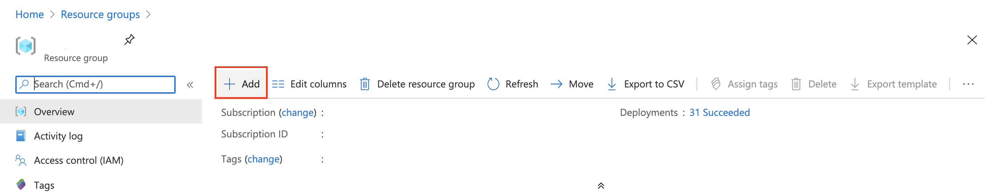
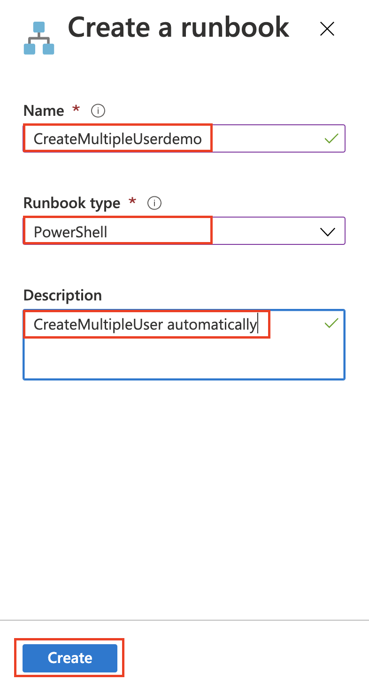

 # 目錄結構
    .
    ├── Before leaving 離職前最後一波小操作
    │   ├── The Goal
    │   ├── Prerequisite 前置要求
    │   ├── Getting Started
    │   │   ├── Storage Account to active Cloud Shell
    │   │   ├── 建立Azure Automation
    │   │   ├── 新增 Module
    │   │   ├── 建立Runbook
    │   │   ├── Runbook Scipt
    │   │   ├── Link to schedule
    │   ├── 價格
    │   ├── 參考資料

# Before leaving 離職前最後一波小操作

## The Goal
自動建立 Azure Resource Group
自動清理 Azure Resource Group

---

## Prerequisite 前置要求
* Azure 帳戶 和 Subscription
* 你自己的資源群組（resource group）
* 應該還是需要 AD 權限啦You need to have a Azure User Account with Admin Active Directory Role(Maybe)

---

## Getting Started

### Storage Account to active Cloud Shell

* 我們需要透過 Azure 上的 Power Shell 來做一些測試，所以點擊Portal上的 Cloud Shell 圖標，跟著步驟去建立屬於你的 Cloud Shell


* 然後你會得到這樣的命令介面（他就是Cloud Shell，Azure上的cmd）

    > ⚠️ 如果你的介面是黑色的那就是 **Bash** 喔，點擊左上角更換為Power Shell ，我要的是Power Shell。

* 在Cloud Shell 裡 使用 Power Shell，然後安裝套件（待會兒要用）

    ```powershell
    # 安裝 Resource Graph module
    Install-Module -Name Az.ResourceGraph
    ```
    

    ```powershell
    # 確認該模組完成導入 & 版本號（當時實作為0.7.7）
    Get-Command -Module 'Az.ResourceGraph' -CommandType 'Cmdlet'
    ```
    

* 玩起來
    ```powershell
    # 算一下總共開了多少資源
    Search-AzGraph -Query "Resources | summarize count()"
    ```
    ```powershell
    # 算一下總共開了多少資源
    Search-AzGraph -Query "Resources | summarize count()"
    ```
    ```powershell
    # 列出資源並按照順序排列
    Search-AzGraph -Query "Resources | project name, type, location | order by name asc"
    ```

### 建立Azure Automation
* 進入你的Resource Group

* 新建一個Resource


* 輸入 ```Automation```，快速搜尋，然後按下 ```Enter```


* 按下 ```Create```


* 填入必要資料，在 ```Create Azure Run As account``` 務必選 ```Yes```，然後 ```Create```


* 接著就是等待建立完成

### 新增 Module
* 我們需要的模組有：
    * Az.Accounts
    * Az.ResourceGraph
    * Az.Resources

* 左側欄位拉至 ```Shared Resources```，選 ```Modules```，右側 ```Browse gallert```


* 在搜尋欄輸入 ```Az.Accounts``` 後，記得按下 ```Enter``` 才能有效搜尋，最後就是點選搜尋出來的結果


* 點選 ```Import``` 以導入模組


* 等待模組```完全導入```後，重複前兩個步驟，接著導入 ```Az.ResourceGraph``` 和 ```Az.ResourceGraph``` 這兩個模組
    > ⚠️ 有些模組有相依行，所以記得**依序**安裝模組：Az.Accounts ➡️ Az.ResourceGraph ➡️ Az.Resources

* 最後就是輸入 ```Az``` 查看是不是三個模組都已經順利導入

### 建立Runbook
* 我們需要兩個runbook：
    * ```自動建立``` 資源群組（Resource group）
    * ```自動刪除``` 資源群組

#### ```自動建立``` 資源群組（Resource group）
* 進入你剛剛建立好的 Automation account 裡面

* 左側欄位拉至 ```Process Automation```，選 ```Runbooks```，右側 ```Create a runbook```


* 輸入Runbook的名字（示範為CreateMultipleUserdemo）
* 類型（Type）選擇 ```PowerShell```
* 描述（Description）建議給一下，這樣也比較清楚

> ⚠️ 當 Runbook 建立成功時候，你會發現畫面跳轉至Coding區域，你可以無視它直接按叉叉，反正之後也可以編輯

> ⚠️ 如果你很堅持要馬上把code貼上的話，這個md你往下滑至 ```Runbook Scipt``` 區域貼上然後 ```Save``` 和 ```Publish```

#### ```自動刪除``` 資源群組
* 重複前面三個步驟，建立另一個Runbook

> ⚠️ 當 Runbook 建立成功時候，你會發現畫面跳轉至Coding區域，你可以無視它直接按叉叉，反正之後也可以編輯

> ⚠️ 如果你很堅持要馬上把code貼上的話，這個md你往下滑至 ```Runbook Scipt``` 區域貼上然後 ```Save``` 和 ```Publish```

* 最後查看所有Runbook，大致上會跟下圖一樣


### Runbook Scipt
* 這裡也分為兩個部分的 Script：
    * 自動建立資源群組的 Script
    * 自動刪除資源群組的 Script

#### 自動建立資源群組的 Script
* 進入剛剛建立好的 ```CreateMultipleUser``` 的 Runbook
* 點擊 ```Edit```，然後貼上以下程式碼：

    ```powershell
    $connectionName = "AzureRunAsConnection"
    try
    {
        # Get the connection "AzureRunAsConnection "
        $servicePrincipalConnection=Get-AutomationConnection -Name $connectionName         

        Connect-AzAccount `
            -ServicePrincipal `
            -Tenant $servicePrincipalConnection.TenantId `
            -ApplicationId $servicePrincipalConnection.ApplicationId `
            -CertificateThumbprint $servicePrincipalConnection.CertificateThumbprint 
    }
    catch {
        if (!$servicePrincipalConnection)
        {
            $ErrorMessage = "Connection $connectionName not found."
            throw $ErrorMessage
        } else{
            Write-Error -Message $_.Exception
            throw $_.Exception
        }
    }

    for ($i = 10; $i -ge 1; $i--) {
        if($i -ne 0){
            $name = "user0" + $i
            Write-Output "==> $name create Success"
            New-AzResourceGroup -Name $name -Location "East US"
            Write-Output "Success"
        }
    }
    ```
* 按下 ```Save``` 然後 ```Published```

#### 自動刪除資源群組的 Script
* 進入剛剛建立好的 ```SubscriptionCleaner``` 的 Runbook
* 點擊 ```Edit```，然後貼上以下程式碼：
    ```powershell
    $connectionName = "AzureRunAsConnection"
    try
    {
        # Get the connection "AzureRunAsConnection "
        $servicePrincipalConnection=Get-AutomationConnection -Name $connectionName         

        Connect-AzAccount `
            -ServicePrincipal `
            -Tenant $servicePrincipalConnection.TenantId `
            -ApplicationId $servicePrincipalConnection.ApplicationId `
            -CertificateThumbprint $servicePrincipalConnection.CertificateThumbprint 
    }
    catch {
        if (!$servicePrincipalConnection)
        {
            $ErrorMessage = "Connection $connectionName not found."
            throw $ErrorMessage
        } else{
            Write-Error -Message $_.Exception
            throw $_.Exception
        }
    }

    $rgs = Get-AzResourceGroup | Where ResourceGroupName -like user*;

    foreach($resourceGroup in $rgs){
        $name=  $resourceGroup.ResourceGroupName;
        Write-Output $name
        $count = (Get-AzResourceGroup | Where-Object{ $_.ResourceGroupName -match 'user' }).Count;
        if($count -ne 0){
            Write-Output "==> $name is empty. Deleting it...";
            Remove-AzResourceGroup -Name $name -Force
            Write-Output "Success"
        }
    }
    ```
* 按下 ```Save``` 然後 ```Published```

### Link to schedule
* 最後就是決定什麼時候要執行 ```Runbook```，也分為二：
    * ```CreateMultipleUser``` 的排程
    * ```SubscriptionCleaner``` 的排程
* 這裡僅示範其中一種，另一個請進行同樣操作

* 進入建立好的 Runbook，點選 ```Link to schedule```


* 點選紅框處


* 點選 ```Create a new schedule```


* 輸入所有必要欄位，決定```開始時間```、```時間區域```、```循環設定```、```時效```
* 最後點選 ```Create``` 即可


---

## 價格
### Automation
#### Pricing details
Process automation includes runbook jobs and watchers. Billing for jobs is based on the number of job run time minutes used in the month and for watchers is based on the number of hours used in a month. Charges for process automation are incurred whenever a job or watcher runs. You will be billed only for minutes/hours that exceed the free included units.

|  | **FREE UNITS INCLUDED (PER MONTH)**	 | **PRICE**
| :--------: | :--------: | :--------: |
| Job run time| 500 minutes| NT$0.061/minute|
| Watchers	| 744 hours	| NT$0.061/hour|


## 參考資料
[Starter Resource Graph query samples](https://docs.microsoft.com/en-us/azure/governance/resource-graph/samples/starter?tabs=azure-cli#list-specific-tag)

[Understanding the Azure Resource Graph query language](https://docs.microsoft.com/zh-tw/azure/governance/resource-graph/concepts/query-language)

[String operators](https://docs.microsoft.com/en-us/azure/data-explorer/kusto/query/datatypes-string-operators)

[Search-AzGraph](https://docs.microsoft.com/en-us/powershell/module/az.resourcegraph/Search-AzGraph?view=azps-4.2.0)

[Quickstart: Run your first Resource Graph query using Azure PowerShell](https://docs.microsoft.com/en-us/azure/governance/resource-graph/first-query-powershell)

[Automation pricing](https://azure.microsoft.com/en-us/pricing/details/automation/)

[]()


