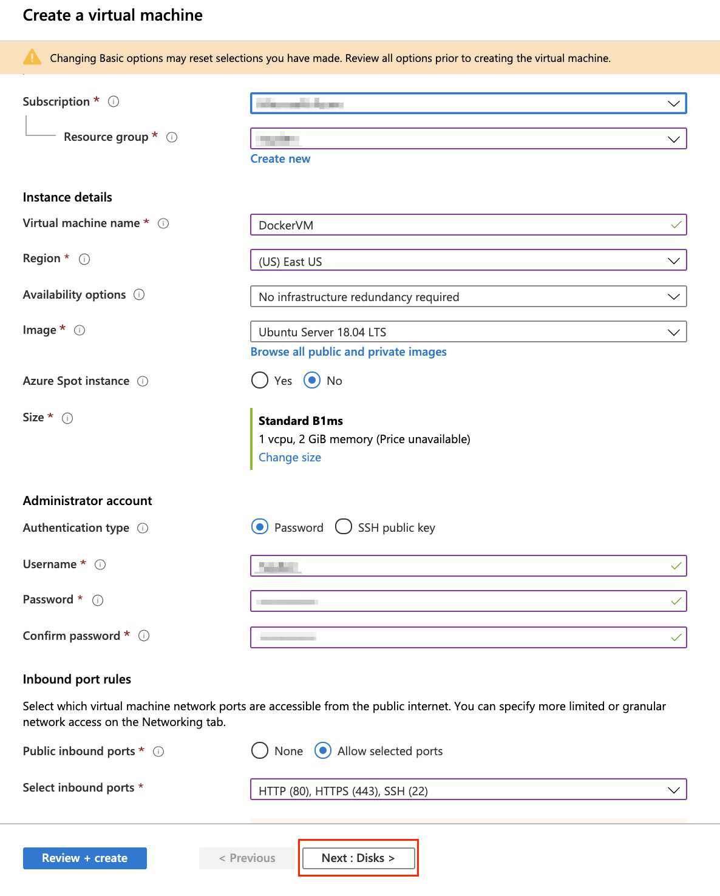

# Azure Container Instance Lab


## Use Case


## Prerequisites
* You need to have Docker install on your computer
* Make sure the region is **US East (N. Virginia)**,

## Let‘s Start
### Warm up！！！
#### On Local（Using Docker On your computer）

#### On Azure Cloud（Using Azure Container Instance）


### Lab 001:
#### Create Storage Account
1.1 At the top of the portal, select the icon to start up cloud shell on Azure
<center></center>

1.2. Select Show advanced settings
<center></center>

1.3. Fill in all information to setup your cloud shell, then click on **Create Storage**.
<center></center>

1.4. You'll see your terminal look like the pic below. Congratulation, your cloud shell setup successfully.
<center></center>

#### Create Virtual Machine
2.1. Go to your resource group, select **+Add** to add resource.
<center></center>

2.2. Choose Virtual machine.
<center></center>

2.3. Fill in all the information that needed.
<center></center>

<center></center>

<center></center>

<center></center>

<center></center>

2.4. When the deployment is complete, select go to resource.
<center></center>

2.5. Copy the Public IP address of your virtual machine, paste it to your notebook or elsewhere for future use.
<center></center>

#### SSH into your virtual machine
3.1. To connect your vm, paste the code below into your cloud shell

3.2. Type **yes** for the connecting question.

3.3. Key in your password that you generate in previous step.

```
ssh user@<public IP>
```

<center></center>

#### Install Docker on your Ubuntu VM
4.1. Update the local database of software to make sure you’ve got access to the latest revisions.
```
sudo apt-get update
```

4.2. Uninstall any old Docker software before proceeding.
```
sudo apt-get remove docker docker-engine docker.io
```

4.3. Install Docker
```
sudo apt install docker.io
```

4.4. Add user into docker‘s group
```
sudo usermod -aG docker $USER
```

4.5. Exit from your VM
```
exit
```

4.6. Reconnect
```
ssh user@<public IP>
```

4.7. Verify the installed Docker version number
```
docker version
```

<center></center>


#### Create a new html and Dockerfile
5.1. Use **_vim_** text editor to create and edit a file called **_index.html_**.  A *index.html* is used to replace the default document that show to user when they reach the website.
```
vim index.html
```

5.2. Press i key to enter insert mode and add the following script.
```html
<html>
<header>
    <meta charset="utf-8">
    <meta name="viewport" content="width=device-width, initial-scale=1">
    <link rel="stylesheet" href="https://maxcdn.bootstrapcdn.com/bootstrap/3.3.7/css/bootstrap.min.css"
          integrity="sha384-BVYiiSIFeK1dGmJRAkycuHAHRg32OmUcww7on3RYdg4Va+PmSTsz/K68vbdEjh4u" crossorigin="anonymous">
    <link rel="stylesheet" href="https://maxcdn.bootstrapcdn.com/bootstrap/3.3.7/css/bootstrap-theme.min.css"
          integrity="sha384-rHyoN1iRsVXV4nD0JutlnGaslCJuC7uwjduW9SVrLvRYooPp2bWYgmgJQIXwl/Sp" crossorigin="anonymous">
    <style>
.header{margin:20px 0}nav ul.nav-pills li{background-color:#800000;border-radius:4px;margin-right:10px}.col-lg-3{width:24%;margin-right:1.333333%}.col-lg-6{width:49%;margin-right:2%}.col-lg-12,.col-lg-3,.col-lg-6{margin-bottom:20px;border-radius:6px;background-color:#f5f5f5;padding:20px}.row .col-lg-3:last-child,.row .col-lg-6:last-child{margin-right:0}footer{padding:20px 0;text-align:center;border-top:1px solid #bbb}
 
    </style>
    <title>Scaffold</title>
    <style>
        div{
            border:1px solid black;
        }
    </style>
</header>
<body>
<main class="container">
    <div class="header clearfix">
        <nav>
            <ul class="nav nav-pills pull-left">
                <li><a href="#">Welcome</a></li>
                <li><a href="#">To</a></li>
                <li><a href="#">Whole new world</a></li>
 
            </ul>
        </nav>
    </div>
    <div class="row">
        <div class="col-lg-12">
            <h4>About Me</h4>
            <p>Basketball, Coding, Marvel, smth...</p>
            <a class="btn btn-warning" href="#" role="button">Click me for more details</a>
 
        </div>
    </div>
    <div class="row">
        <div class="col-lg-3">
            <h4>Iron Man</h4>
            <p>Sometimes you gotta run before you can walk</p>
            <a class="btn btn-warning" href="#" role="button">I love you 3000.</a>
 
        </div>
        <div class="col-lg-3">
            <h4>Captain America</h4>
            <p>I don’t want to kill anyone. I don’t like bullies; I don’t care where they’re from.</p>
            <a class="btn btn-warning" href="#" role="button">I can do this all day.</a>
 
        </div>
        <div class="col-lg-3">
            <h4>Michael Jordan</h4>
            <p>I can accept failure. Everyone fails at something. But, I can’t accept not trying.</p>
            <a class="btn btn-warning" href="#" role="button">I love this game!</a>
 
        </div>
        <div class="col-lg-3">
            <h4>Kobe Bryant</h4>
            <p>I know that the appearance of Los Angeles at four o 'clock in the morning every day.</p>
            <a class="btn btn-warning" href="#" role="button">Black Mamba</a>
 
        </div>
    </div>
    <div class="row">
        <div class="col-lg-6">
            <h4>LeBron James</h4>
            <p>Every night on the court I give my all, and if I’m not giving 100 percent, I criticize myself.</p>
            <a class="btn btn-warning" href="#" role="button">Be a King.</a>
 
        </div>
        <div class="col-lg-6">
            <h4>Allen Iverson</h4>
            <p>I take every game as my last one game to play.</p>
            <a class="btn btn-warning" href="#" role="button">Practice?!</a>
 
        </div>
    </div>
 
</main>
<script src="js/jquery.min.js"></script>
<script src="js/bootstrap.min.js"></script>
</body>
</html>
```

5.3. Press **`ESC`** key to return to command mode.

5.4. Type **`:wq`** to save and exit.
```
:wq
```
5.5. Use **_vim_** text editor to create and edit a file called **_Dockerfile_**.  A *Dockerfile* is a manifest that describes the base image to use for the Docker image and what we want installed and running on it.
```
vim Dockerfile
```

5.6. Press **`i`** key to enter insert mode and add the following script.
```
FROM nginx:alpine
COPY . /usr/share/nginx/html
```


5.7. Press **`ESC`** key to return to command mode.

5.8. Type **`:wq`** to save and exit.
```
:wq
```

5.9. Make sure you have two files in the directory.
<center></center>

#### Build docker image
6.1. Build the Docker image from *Dockerfile*.
  >Note: "my_web_server" is the docker image name and "./" means the Dockerfile can be found in current directory.

```
docker build -t my_web_server ./
```

6.2. List docker images to verify whether the image was created correctly. We should be able to see there is an image called **_my_web_server_**.

```
docker image ls
```
 
6.3. Run the newly built image. The **`–p 8080:80`** option maps the exposed port 80 on the container to port 8080 on the host system.
>Note: Remember to edit the inbound rule of the virtual machine to allow port 8080.
```
docker run --name my_web_server -d -p 8080:80 my_web_server
```

6.4. Open your browser, type your virtual machine's Public IP Address followed by **：8080**, you should see a static website show on your browser.

#### Create a Registry on Azure: Azure Container Registry(ACR)
7.1. Select **+Add** to add resource.
<center></center>

7.2. Select **Containers** on your left hand side, then select **Container Registry**.
<center></center>

7.3. Fill in the information that it needed.

7.4. Click on **Create**.
<center></center>

7.5. When the resource succeed to deploy, select **Go to resource**.
<center></center>

7.6. Copy you **Login server** for future use.
<center></center>

7.7 We need to Enable admin user for ACR login.
<center></center>

#### Tag Image and Push to ACR
8.1. After login into your ACR, tag the image that you need to upload to ACR.

<center></center>

8.2. Before you can push an image to your registry, you must tag it with the fully qualified name of your ACR login server

8.3. The login server name is in the format <registry-name>.azurecr.io (all lowercase)

8.4. Use docker push to push the image to the ACR instance.

<center></center>

8.5. After pushing the image to your container registry, make sure the image is show in your repositories.
<center></center>

#### Conclusion

Congratulations! We now have learned how to:

* Setup a Docker image.
* Create a Microsoft Container Registry.
* Tag and push image to ACR.

### Lab 002:

### Lab 003: