# 使用 Azure Portal 部署容器執行個體

使用 Azure 容器執行個體在 Azure 中簡潔且快速地執行無伺服器 Docker 容器。 當您不需要像 Azure Kubernetes Service 的完整容器協調流程平台時，請視需要將應用程式部署至容器執行個體。
在本快速入門中，您會使用 Azure 入口網站部署隔離式 Docker 容器，並使用完整網域名稱 (FQDN) 讓其應用程式可供使用。 在設定一些設定並部署容器之後，您可以瀏覽至執行中的應用程式：

---
## 先決條件
- 擁有一個Azure帳戶
- 建立一個獨立、屬於自己的資源群組（resource group）

---
## 開始實作

### Azure Container Instance建立
1.1. 前往 Azure Portal，進入自己的資源群組

1.2. 點擊 **+Add**

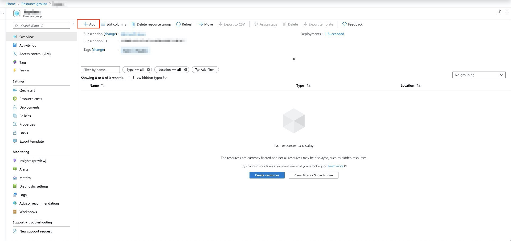

1.3. 於左側欄位選擇 **Container** ，接著點擊 **Container Instance** 

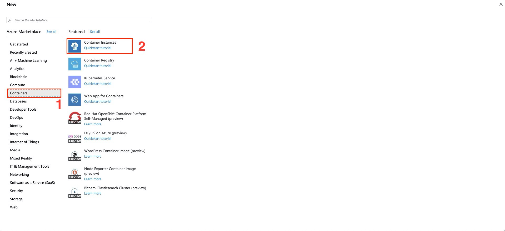

1.4. 在 **Basic** 區塊，我們將以下需求填寫完畢後，點選 **Next：Networking** 進入下一步設置

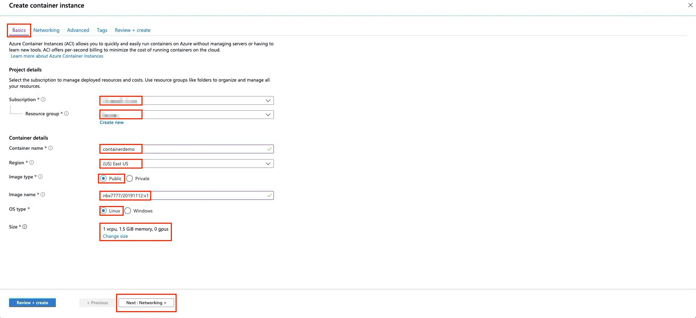

| 選項 | 備註 |
| -------- | -------- |
| Subscription | 選擇自己的訂用帳戶 |
| Resource Group | 選擇自己的資源群組 |
| Container name  | 填寫容器名稱 |
| Region | (US)East US |
| Image type | Public |
| Image name | nbx7777/20191112:v1 |
| OS type | Linux |
| Size | 預設 |

1.5. 在 **Networking** 區塊，我們希望 container 本身含有一個對外IP、開啟 Http 80 port 以及 網域名稱（DNS）

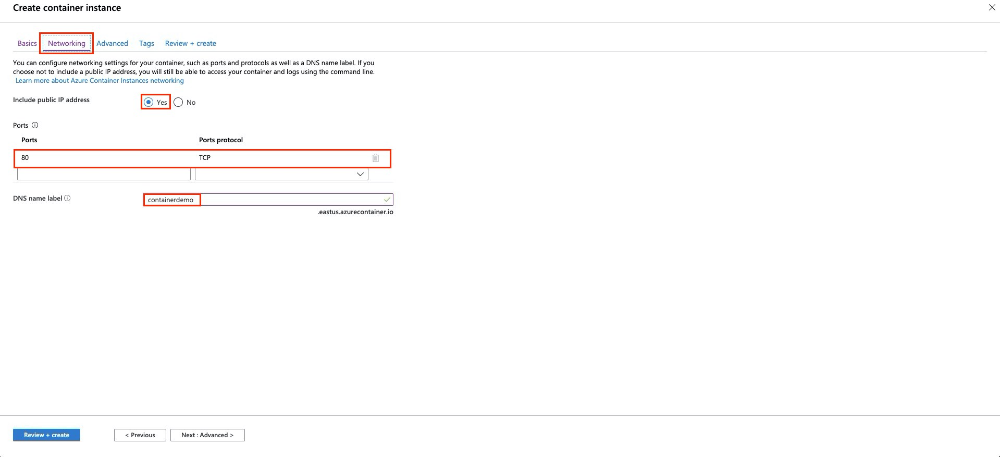

1.6. 在 **Tags** 區塊，建立一個tags，最後點選 **Review + create**

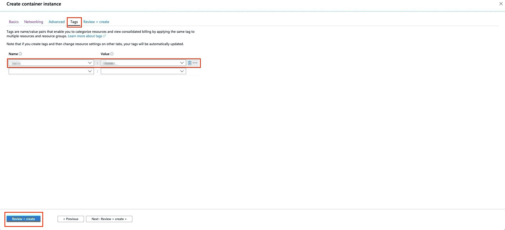

1.7. 在 **Review + create** 區塊，通過認證後，檢查剛剛的一系列設定

1.8. 按下 **Create**

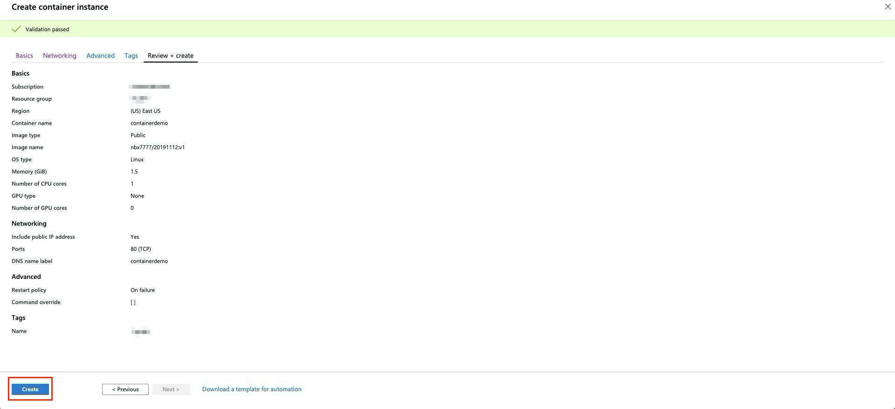

1.9. 介面會顯示 **Your deployment is underway**，表示資源正在建立

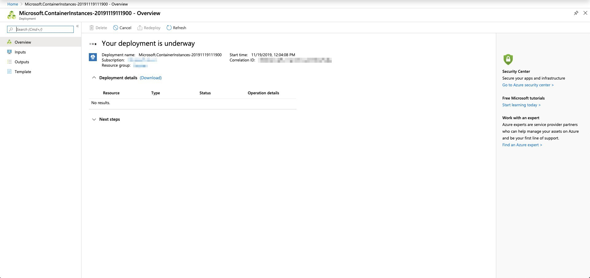

### 瀏覽網頁
2.1. 容器成功部署後，點選 **Go to resource**

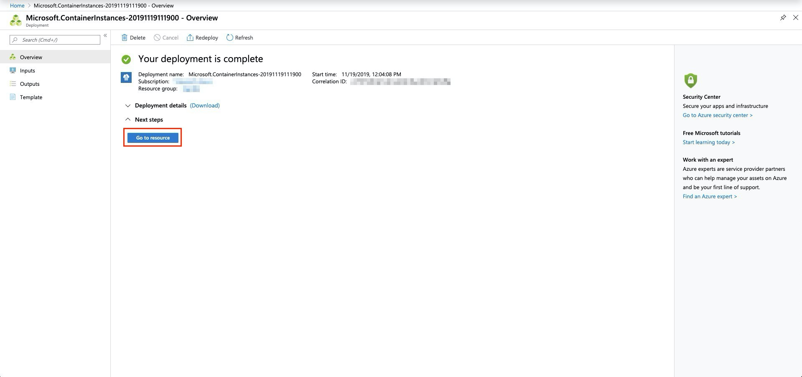

2.2. 我們可以看見我們所建立容器正在運行中

2.3. 將 **FQDN** 複製，粘貼至瀏覽器

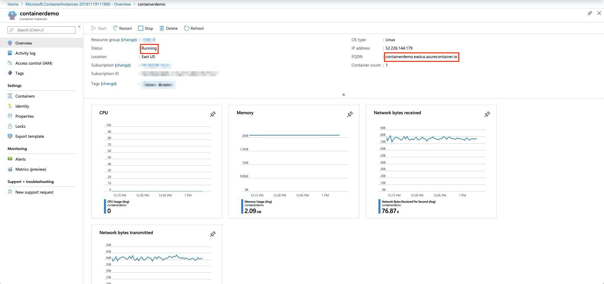

2.4. 如果出現以下畫面，恭喜！我們成功將Docker容器中的application部署到Azure上了

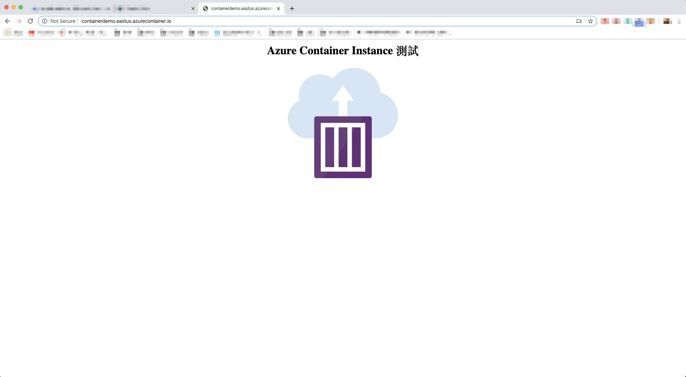

### 檢視容器紀錄
3.1. 點選 **Container**，再點選 **Logs

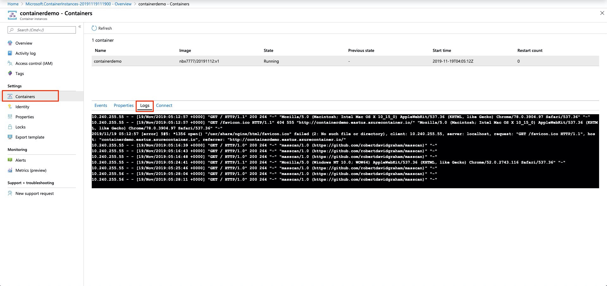

### 刪除容器
4.1. 點選 **Overview**
4.2. 點選 **Delete**後，按下 **Yes** 即可刪除

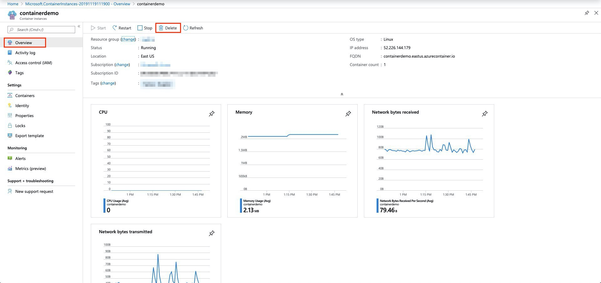

