# 使用 Azure CLI 部署容器執行個體

使用 Azure Container Instance 簡潔且快速地執行無伺服器 Docker 容器。
我們會使用 Azure CLI 部署隔離式 Docker container，並使用完整網域名稱 (FQDN) 讓其應用程式可供使用。 
執行單一部署命令的幾秒之後，您可以瀏覽至容器中執行的應用程式：

<center></center>

---
## 先決條件

- 擁有一個Azure帳戶
- 建立一個獨立、屬於自己的資源群組（resource group）

## 使用 Azure Cloud Shell
Azure Cloud Shell 是裝載於 Azure 中的互動式環境，也可在瀏覽器中使用。 您可以使用 Bash 或 PowerShell 搭配 Cloud Shell，與 Azure 服務共同使用。 Azure Cloud Shell 已預先安裝一些命令，我們不需要在本機端上安裝任何工具，即可讓我們執行本教學篇提到的程式碼。

-----
## 開始實作

### 開啟 Azure Cloud Shell
1.1. 前往 Azure Portal，點擊右上角功能列的 Cloud Shell 區塊

1.2. 點擊 **Show advanced settings**
<center>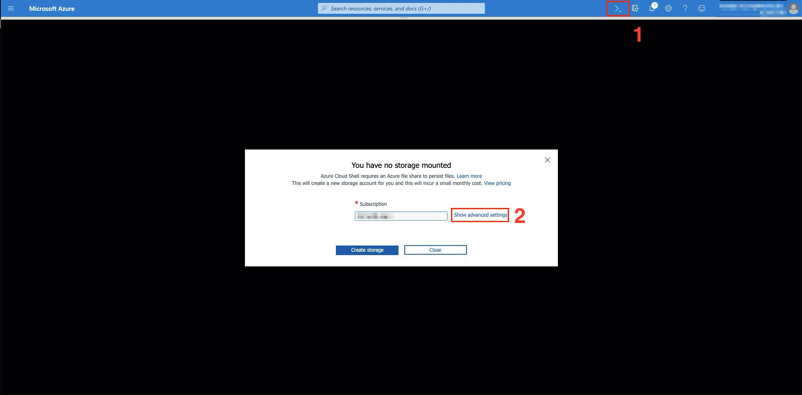</center>

1.3. 所有選項點選完畢後，點擊 **Create storage** 建立
<center>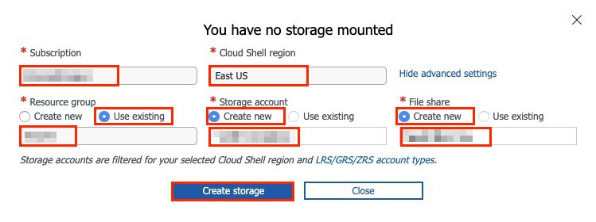</center>

| 選項 | 備註 |
| -------- | -------- |
| Subscription | 選擇自己的訂用帳戶 |
| Cloud Shell region | East US |
| Resource Group | Use existing-選擇自己的資源群組 |
| Storage account | Create new |
| File Share | Create new |

1.4. 建立完畢後，會呈現以下畫面
<center>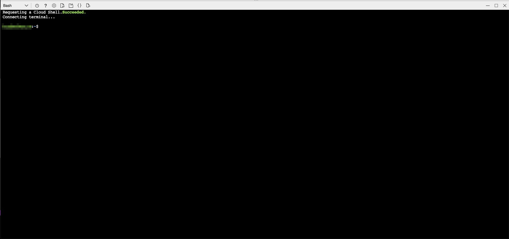</center>

---

### 建立資源群組
此步驟透過 Azure Cloud Shell 建立**資源群組**（resource group）。
除了透過Azure Portal介面操作以外，我們亦可使用 Azure CLI 來建立建立資源群組。
- 使用 **az group create** 指令，在 **east us** 建立一個資源群組。
- 請將 **<資源群組名字>** 替換為自身的資源群組名稱
```
az group create --name <資源群組名稱> --location eastus
```
---

### 建立容器（Azure Container Instance，ACI）
2.1. 透過以下指令， 建立ACI
```
az container create --resource-group <資源群組名稱> --name <容器名稱> --image nbx7777/20191112:v1 --dns-name-label <DNS>-demo --ports 80
```
| 選項 | 備註 |
| -------- | -------- |
| <資源群組名稱> | 替換為自己的資源群組 |
| <容器名稱> | 替換為自己想要的容器名稱 |
| < DNS > | 網域名稱，替換為自己想要的名稱，在所處Azure區域中必須是唯一 |


2.2. 以上，我們提供了資源群組名稱、ACI名稱以及我們所需要使用的映像檔（image，這裡我們使用一個public的映像檔）

2.3. 稍後一下，Azure CLI會呈現以下畫面表示成功部署
<center>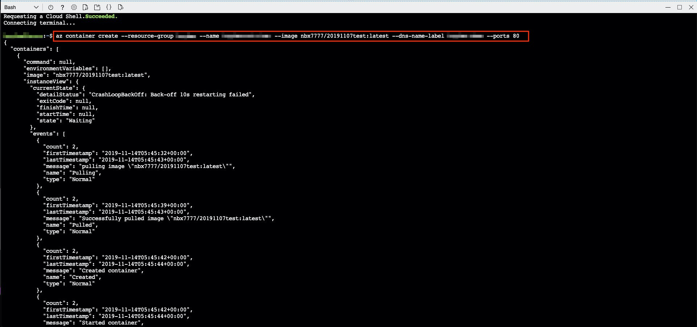</center>

2.4. 由於 DNS 於所在的 Azure 區域中必須是唯一，如果出現錯誤告知「DNS無法使用」，請嘗試其他不同的 DNS 名稱

---

### 檢查 Container Instance 狀態
3.1. 透過以下指令， 檢查 Container Instance 狀態
```
az container show --resource-group <資源群組名稱> --name <容器名稱> --query "{FQDN:ipAddress.fqdn,ProvisioningState:provisioningState}" --out table
```

| 選項 | 備註 |
| -------- | -------- |
| <資源群組名稱> | 替換為自己的資源群組 |
| <容器名稱> | 替換為自己想要的容器名稱 |

3.2. 鍵入指令後，會呈現以下畫面，顯示 FQDN 以及 部署狀態
<center>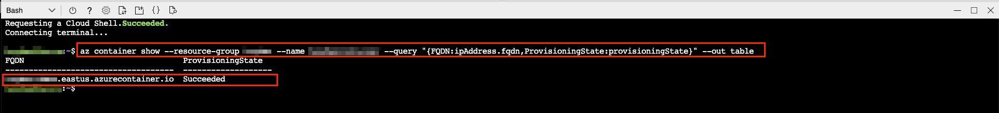</center>

3.3. 如果 container 的ProvisioningState 為 「Succeeded」，請將 FQDN 複製，到瀏覽器貼上後瀏覽

3.4. 如果出現以下畫面，恭喜！我們成功將Docker容器中的application部署到Azure上了
<center>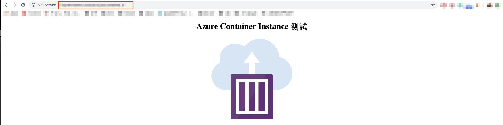</center>

---

### 附加：提取容器記錄 
- 透過以下指令，根據輸出結果，對容器進行除錯
```
az container show --resource-group <資源群組名稱> --name <容器名稱> --query "{FQDN:ipAddress.fqdn,ProvisioningState:provisioningState}" --out table
```

- 會呈現以下畫面
<center>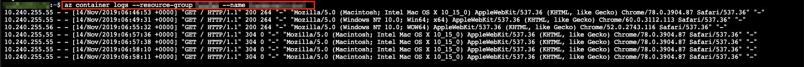</center>

- 或是透過以下指令進行，最後以 Ctrl+c退出
```
az container attach --resource-group <資源群組名稱> --name <容器名稱>
```
<center>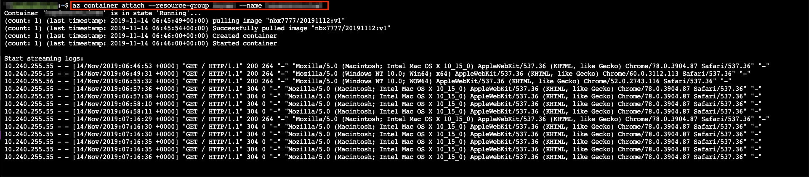</center>

---

### 停止運行容器
4.1. 在停止運行中的容器前，先至 Azure Portal 上查看 ACI 的運行狀態是「正在運行中」的
<center>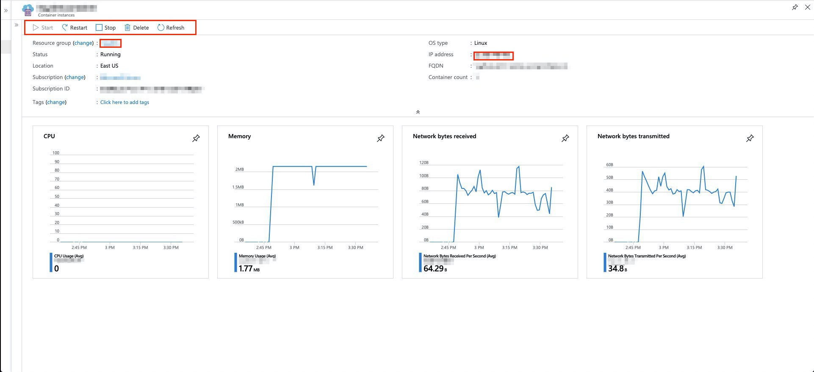</center>

4.2. 透過以下指令，停止運行中容器
```
az container stop --resource-group <資源群組名稱> --name <容器名稱>
```
<center></center>

4.3. 回到 Azure Portal 介面上查看，發現 ACI 已經停止，等待下次重啓
<center>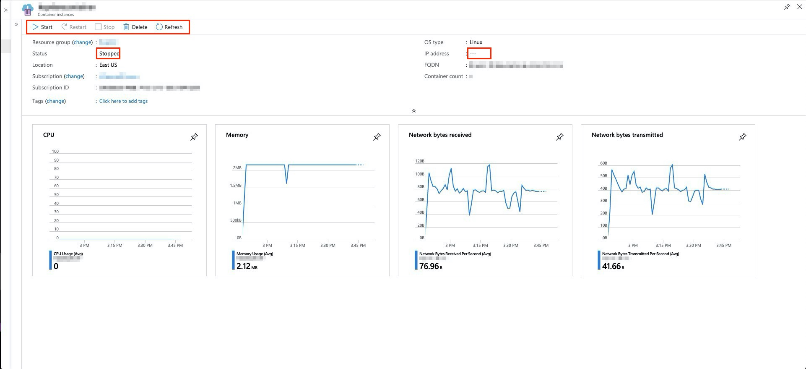</center>

4.4. 把之前瀏覽的測試網頁重新刷新，發現 loading 很久都沒有畫面顯示，最後告知我們這個網頁無法造訪是「正確的」，因為我們已經把 ACI 停止運行了。

4.5. 透過以下指令啟動 ACI，並再次將 FQDN 複製到瀏覽器中查看網頁是否正常運行
```
az container start --resource-group <資源群組名稱> --name <容器名稱>
```

### 清除資源
5.1. 透過以下指令來移除位於資源群組內的容器
```
az container delete --resource-group <資源群組名稱> --name <容器名稱>
```
<center>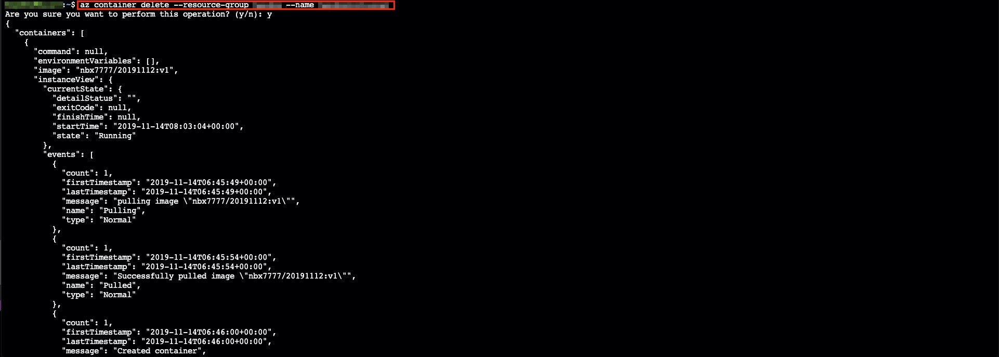</center>

az container delete --resource-group hayden --name haydencontainer