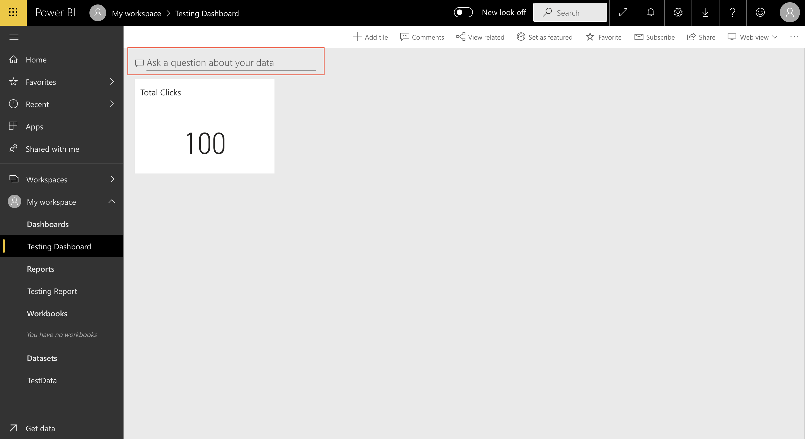

# Build Clickstream analyze with Azure Blob Storage, Azure Stream Analytics and Power BI

## Scenrio
In this lab, you will produce a Power BI dashboard by using an Azure Blob Storage and Azure Stream Analytics.

You will commence by signing in to Power BI, and then signing in to the Azure Portal to create an Storage account, containers in storage account, and then a Stream Analytics job.

## Prerequisites
* An Azure subscription.
* Any code editor (in this lab we use VScode as our code editor).
* Power BI Account.


## Lab tutorial
### Create Resource Group
1.1. Click on the upper left corner to expand the portal.

1.2. Click ```Resource groups```


1.3. Click ```+Add``` to add your Resource group.


1.4. Choose your ```Subscription```

1.5. Fill in the ```name``` of your resource group .

1.6. Click on ```Review + create```.


1.7. Wait until ```Validation passed``` show in your screen, click ```Create```.


1.8. Congratulations! You've built your ```Resource group```
> Notice: If your resource group didn't show up, don't forget to press F5 to refresh your browser.


### Create Storage Account
2.1. Click ```+Add``` to add an resource.


2.2. Searching ```Storage Account``` at the searching bar and press ```Enter```


2.3. Select ```Storage account```.


2.4. Click on ```Create```.


2.5. Fill in all the information, then select ```Review + Create```.


2.6. Wait until ```Validation passed``` show in your screen, click ```Create```.


2.7. Congratulations! You've built your ```Storage Account```
> Notice: If your storage account didn't show up, don't forget to press the refresh button to refresh your browser.


### Create Container Blob service in Storage Account
3.1. Inside your resource group, click the storage account that you create just now.


3.2. Inside your storage account, choose ```Containers```.


3.3. Click on ```+Container```

3.4. Name your container, at here we use ```blob001``` for data input 

3.5. Select ```Public access level``` as ```Container```


3.6. Repeat step 3.3 to 3.5 to creat another container for data output testing, named it ```blob002```


### Create Stream Analytics
4.1. Click ```+Add``` to add resource into your resource group.


4.2. Searching ```Stream Analytics job``` at the searching bar and press ```Enter```


4.3. Click ```Create``` to create Stream Analytics.


4.4. Fill in all the information, we use ```demoStreamAnalytics``` as our name

4.5. Choose ```Create```.


4.6. Congratulations! You've built your ```Stream Analytics```
> Notice: If your storage account didn't show up, don't forget to press the refresh button to refresh your browser.


### Stream Analytics - Job topology
At this section, we have to config input, output and query of the Stream Analytics
#### Input
5.1. With your Stream Analytics, click ```Inputs``` at the left of the portal, it's under ```Job topology``` section.


5.2. Click on ```+ Add input stream```, then choose ```Blob storage``` as our input type.


5.3. After fill in all the information that needed, press ```Save``` to create your stream input.


> Notice: If you encounter the “Failed to load storage accounts” situation, please press F5 to refresh the browser


5.4. Make sure that the input has show on your portal, if not please refresh your browser.


#### Output
5.5. With your Stream Analytics, click ```Outputs``` at the left of the portal, it's under ```Job topology``` section.


5.6. Click ```+Add```, then choose ```Power BI```.


5.7. Complete the authorization by using the account you used to sign in to Power BI.


5.8. Enter the required box.
|Title | Enter |
|-----|--------|
| Output alias | biresult|
| Group workspace  | My workspace |
| Dataset name | TestData |
| Table name | TestTable |


5.9.  Make sure that the output has show on your portal, if not please refresh your browser.


#### Query
5.10. With your Stream Analytics, click ```Query``` at the left of the portal, it's under ```Job topology``` section.


5.11. Replace all six lines of the query template with the following query.
>Notice that the FROM clause describes the job input, while the INTO clause describes the job output.
```
SELECT
    Time,
    User_id,
    Country,
    Category,
    Product,
    COUNT(*) AS Clicks
INTO
    biresult
FROM
    datainput
GROUP BY
    Time,
    User_id,
    Country,
    Category,
    Product,
    TUMBLINGWINDOW(SECOND, 10);
```


5.12. Click ```Save Query```.

 
### Testing - Blob
6.1. Create a folder to save the files that we need, named it as ```ClickStream```.

6.2. In the ```ClickStream``` folder, create another folder named ```sample_data```.

6.3. Create a python file named ```create_data_upload_blob001```, saved it as ```.py``` format.

6.4. Paste the below python code in ```create_data_upload_blob001.py``` files.
```python
from azure.storage.blob import BlockBlobService
from azure.storage.blob import ContentSettings
from azure.storage.blob import PublicAccess
import csv
import random
import time
import datetime
import os
path = '<replace the path by using your simple_data file`s path> '
os.chdir(path)

# Blob 相關
mystoragename = "<Home --> your RESOURCE GROUP --> demousestorageaccount --> Access keys --> copy Storage account name>"
mystoragekey = "<Home --> your RESOURCE GROUP --> demousestorageaccount --> Access keys --> copy key 1 >"
blob_service = BlockBlobService(account_name=mystoragename, account_key=mystoragekey)

i = 1 

for a in range(1):
    with open('testing'+str(i)+'.csv', 'w', newline='') as file:
        writer = csv.writer(file)
        writer.writerow(["User_id", "Time", "Country","Category","Product"])
        
    for j in range(100):
        timestamp = datetime.datetime.now()
        user = str(random.randint(1, 10000))
        country = random.choice(['United States', 'United Kindom', 'Taiwan', 'Canada', 'Australia', 'India', 'Japan', 'Philippines', 'Singapore', 'South Korea'])
        category = random.choice(['Blog', 'Community', 'Examples', 'Register', 'Search', 'Training'])
        product = random.choice(['Mobile', 'Computer','Tablet'])
        with open('testing'+str(i)+'.csv', 'a+', newline='') as file:
                writer = csv.writer(file)
                writer.writerow([user, timestamp, country, category,product])

    blob_service.create_blob_from_path(
        'blob001',
        'testing'+str(i)+'.csv',
        'testing'+str(i)+'.csv',
        content_settings=ContentSettings(content_type='application/csv'))

    i += 1
    time.sleep(5)
```

6.5. Replace the ```path```, ```mystoragename```, ```mystoragekey``` by using your own value.
> Notice: The ```i``` variable for us to control how many csv files we need to create and upload to blob001.

6.6. After doing all this, you should see the files already create in you ```sample_data``` and upload to blob001.


6.7. When the files uploaded to blob container, we can saw the ```input preview``` in Stream Analytics
>Notice: If you didn't see anything change, please press the refresh icon.


6.8. Click ```Test Query``` to test our query language is correctly work, it will present in ```Test resulys```.


### Testing - Stream Analytics to Power BI
7.1. Delete the csv file that we upload just now, and also delete the file on your local.

7.2. Click on ```Start```icon, then click another ```start``` to start our Stream Analytics job.


7.3. Wait until the status changed to ```Running``` then keep going to the next step.


7.3. Run again your python code to generate one csv file and upload to blob001.

7.4. To create a report, in the Navigation Pane, click the ```TestData``` dataset.


7.5. In the Fields pane (located at the right), notice the ```TestTable``` table.

7.6. To add a visual, check the ```Clicks``` field.

7.7. To modify the ```VISUALIZATION``` type to card, in the ```VISUALIZATION``` pane, select ```Card```.

7.8. To save the report, at the right corner, click ```Save```.


7.9. Save our report as ```Testing Report```.


7.10. click the ```Pin Visual``` icon.


7.11. Save it to ```New dashboards```, named it ```Testing Dashboards```, press ```Pin```


7.12. At our ```Dashborads```, to modify the tile title, hover the cursor over the tile, click the ellipsis, and then select ```Edit details```.


7.13. In the Title box, modify the text to ```Total Clicks```. Then click ```Apply```.


7.14. In the Q&A box, enter ```Clicks for time in last 60 seconds```, and then review the response



7.15. To create a dashboard tile for this question, at the top-right corner, click the ```Pin Visual```.


7.16. Pin the visualization to the existing dashboard.


7.17. Modify the title of the new tile to T```otal Clicks```, and the subtitle to ```Last Minute```.


7.18. Verify that the dashboard layout looks like the following.


7.19. Create another tile by asking ```Clicks for time in last 60 seconds by category sorted by clicks```.

7.20. Create another tile by asking ```Clicks for time in last 60 seconds by category sorted by clicks```.

7.21. Modify the tile titles as follows.


7.22. Create another tile by asking ```Clicks for time in last 60 seconds by country as map```.

7.23. Modify the tile titles as follows.


7.24. Create another tile by asking ```Clicks by time in the last 300 seconds```.

7.25. Modify the tile titles as follows.


7.26. Run again your python code create second file in local and upload to blob.

7.27. Wait about a minute, refresh your dashboard to see the changes.

7.28. Create more files and upload to see the result. Have fun.


## Funishing-Up
To limit cost for your Azure subscription, you must follow the steps in this exercise to delete the Azure Resource Group.

1. In ```Stream Analytics```, press ```Stop``` to stop the Stream Analytics job.


2. In ```blob001```, select all the files that you create.


3. Remove the ```Dashboards```, ```Reports```, ```Datasets``` in Power BI.


4. Remove your resource group. Type in your resource group name to confirm delete.


## 參考網址
* https://docs.microsoft.com/en-us/stream-analytics-query/where-azure-stream-analytics
* https://docs.microsoft.com/en-us/azure/stream-analytics/stream-analytics-stream-analytics-query-patterns
* https://docs.microsoft.com/en-us/azure/stream-analytics/stream-analytics-custom-path-patterns-blob-storage-output
* https://sandervandevelde.wordpress.com/2016/10/11/raw-stream-analytics-output-using-azure-storage/
* https://docs.microsoft.com/zh-tw/stream-analytics-query/tumbling-window-azure-stream-analytics
* https://docs.microsoft.com/en-us/azure/stream-analytics/stream-analytics-add-inputs
* https://docs.microsoft.com/en-us/azure/stream-analytics/powerbi-output-managed-identity