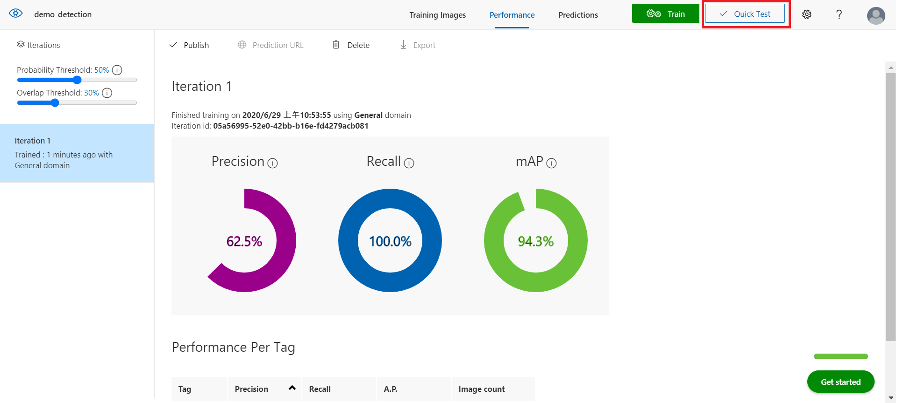
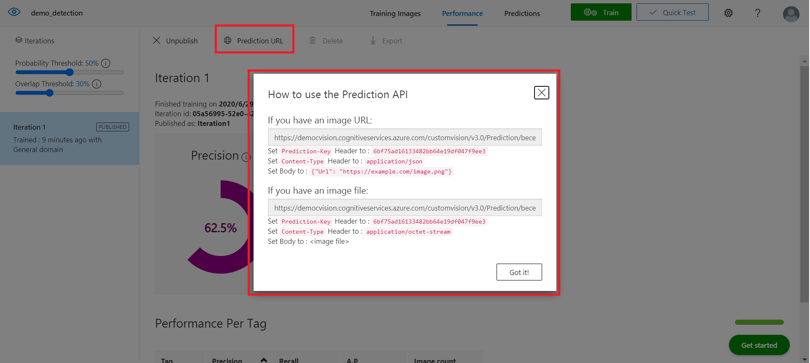
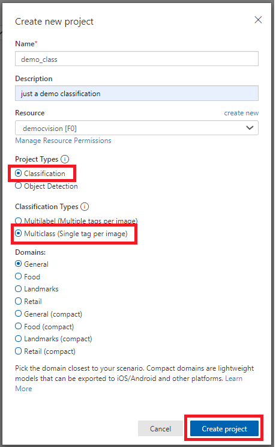
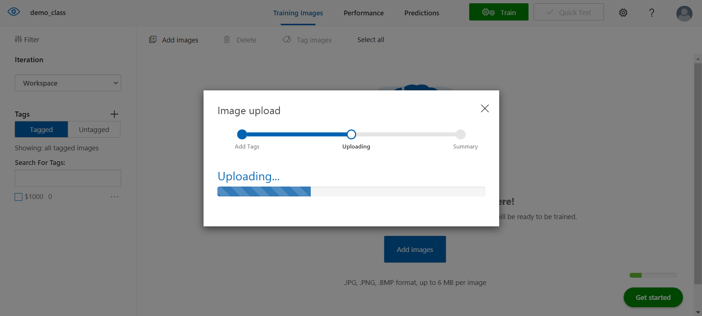

# Azure Custom Vision 

## Prerequisite 前置要求
* Azure account 和 Subscription
* Your own resource group

## Getting Started
### Create Resource Group

* Click on `Resource groups`

* Click `+Add` to add a resource groups

* Select `Subscription`
* Name your `Resource group`
* Select the `Region` with `East US`
* Click on `Review + create`

* Click `Create` after the validation passed

* Wait until the deployment seccessed, you'll see your resource group show on the Resource groups page
* Enter your resource by click on it

    > ⚠️ If the resource group that you create didn't show, please click `Refresh` to refresh the page

### Create Custom Vision
* Click `+Add` to add a resource inside your resource group

* Seacrh `custom vision` using the searching bar, then click on `Csutom Vision`

* Click `Create` to create custom vision

* Choose `Both` on create options
* Select your `Subscriptions`
* Select your `Resource group` that you create just now
* Named the custom vision that you want（I use `democvision` for the name）

* Select the `Training location`
* Select the `Training pricing tier`
* Select the `Prediction location`
* Select the `Prediction pricing tier`
* Click on `Review + create`

* Click `Create` to create custom vision

* Wait the deployment success

* Choose `Go to resource` after the deployment is complete

### Train you model
* Under `RESOURCE MANAGEMENT` section, choose `Quick start`
* Select `Custom Vision portal` to direct to a new browser page

* Click `SIGN IN` (use the same account that you sign in to azure portal)

* Click `NEW PROJECT` to create a new project

* Name the project
* Add a `Description`
* Choose `Resource`
* Choose `Project Types`
* Choose `Domains`
* Choose `Create project`

* Click `Add image` to add image to train
* Choose all the image files in `train` folder

* Upload image

* Wait the files uploading

* Click `Done` when those images uploaded successfully

* Now those images that we upload are `Untagged`
* Choose any image

* Choose the area that you want to detect
* Give a tag to it (dollar in this demo)
* Tag all the train image that we uploaded by doing the previous two step

* After taging all the images, we can see all the images classified to `Tagged` section
* Select `Train` to train model

* Select `Quick Training` for this demo
* Click on `Train` button

* Wait the model training

* After the model train successfully, choose `Quick Test` to test the model

* Click `Browse local files` to upload images (using any images in `test` files)

* There's a result output 

### Publish
* Select `Publish`

* Name the `module`
* Selet the `Prediction resource`
* Click on `Publish`

* Select Prediction URL
* For future use

### Classification
* Click `NEW PROJECT` to create another project

* Fill in the information needed
* Don't forget choose `Classification`
* `Multiclass` for Classification Types

* Click on `Add images` to add images

* Choose all the image files in `train` folder（TWD 1000）
* Remember to add `$1000` tag then `upload`

* Wait for the images upload

* Click `Done` when the image complete upload

* `Add images` to add another type of images

* Choose all the image files in `$100` folder
* Remember to add `$100` tag then `upload`

* Click `Train`
* Choose `Quick Training` for Training Type
* Then `Train`

* After the training jobs done, click on `Quick Test`

* `Browse local files` to have a test

* See the result output

* There's a recogition error with TWD 1000 and mask
* We can train `mask type` images too prevent this kind of error

## Clean Up
* Back to Azure portal
* Click on the resource group that you create
* Press `Delete resource group`

