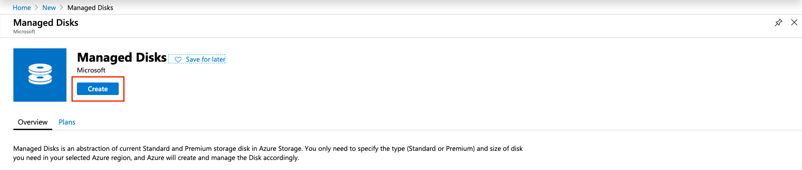
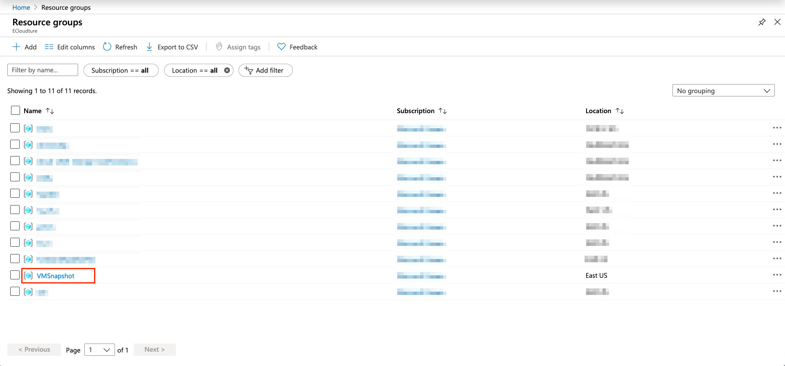

# Playing with Disk Snapshot

## Use Case
磁盤快照是管理Azure 虛擬主機的強大工具。它的創建很簡單，可以幫助管理員完成各種任務。
快照集是完整的虛擬硬碟 (VHD) 唯讀複本。 您可以製作 OS 或資料磁碟 VHD 的快照集當作備份，或用來針對虛擬機器 (VM) 問題進行疑難排解。
當然，最後一道防線是Azure備份，但是使用快照不需要等待整個備份/恢復時間。
對於快照，有兩個恢復VM的主要選項。一種是使用“交換操作系統磁盤”功能，只需單擊一下就可以輕松地交換作業系統磁盤。另一個選項是創建一個新的虛擬機。

## Prerequisites
* 一個有效、能夠使用的Azure帳戶

## Let‘s Start

### Create Resource Group
---
1.1. 登入AzurePortal，展開面板後，選擇資源群組

1.2. 點選 `+Add` 以增加一個新的資源群組

1.3. 在 `Basic` 頁面，選擇欲使用的 `訂用帳戶`、`名稱` 以及 `地理位置`，之後點選 `Review + create`

1.4. 審核成功後，點選 `Create` 

1.5. 打開右上角小鈴鐺，點選 `Go to resource group`

### Create a Virtual Machine
---
2.1. 在資源群組裡建立一台虛擬主機，請點選 `+Add` 以新增資源

2.2. 從左側欄位點選 `Compute`，再選取 `Virtual Machine`

2.3. 填寫以下資訊，點選 `Review + create`，審核成功後，點選 `Create` 

### Create SnapShot
---
3.1. 建立好虛擬機後，點選 `Go to resource`

3.2. 點選左側欄位的 `Disks`，接著選取（右側）目前虛擬機所掛載的硬碟

3.3. 點選 `Create snapshot` 為此硬碟做一個快照

3.4. 填寫以下資訊，RG選擇先前建立的 --> `VMSnapshot`

3.5. 接著為填寫 `Name` 和 `Account type`，最後點選 `Create`

### Create Disk
---
4.1. 點選左上角 `Microsoft Azure` 會倒主畫面後，點選 `Create a resource`

4.2. 在搜尋欄位鍵入 `Managed Disks` 後按下Enter

4.3. 點選 `Create` 以建立Managed Disks

4.4. 將以下資料填寫完畢，即點選 `Review + Create`，接著 `Create`

### Swap OS Disk
---
5.1. 點選左上角 `Mocrosoft Azure` 會倒主畫面後，點選 `Resource Group`

5.2. 選擇資源群組 --> `VMSnapshot`

5.3. 選擇剛剛建立好的虛擬機 --> `DemoVM`

5.4. 在Setting底下點選 `Disks`，選擇上方 `Swap OS Disk`

5.5. 於右側彈出的設定精靈裡，選擇作為替換的硬碟 `SnapshotOS2` 以及輸入虛擬機的名字作為確認需求，最後點選 `OK` 進行替換

5.6. 替換過程中，系統會幫我們把運行中的虛擬機暫停後再執行替換硬碟的動作

5.7. 重新刷新頁面，會發現硬碟已經被替換，做到這裡，恭喜你～你成功了！

### Another option - New Azure VM
---
6.1. 進入到由 `snapshot` 建立而成的 `Managed Disk` 裡，點選 `Create VM`

6.2. 設定中，將 `image` 調整為先前建立的硬碟即可

### Clean Up
---
7.1. 點選要刪除的資源群組，進入後選擇 `Delete resource group`，右側輸入群組名稱後按下 `Delete` 即可刪除資源群組以及群組內的所有資源，避免金錢流失 

