# Playing with Disk Snapshot

## Use Case
Disk Snapshot is a powerful tool to manage Azure VMs. It’s simple to create and can help the administrators in various tasks. 
A snapshot is a full, read-only copy of a virtual hard drive (VHD). You can take a snapshot of an OS or data disk VHD to use as a backup, or to troubleshoot virtual machine (VM) issues. 
Of course the last line of defence is the Azure Backup, but using the Snapshot you don’t need to wait the whole Backup / Restore times. 
With snapshots there are two main options to recover the VM. One is using the “swap OS Disk” functionality, which gives you the ease to swap the Operating System disk with one click. The other option is to create a new VIrtual Machine.

## Prerequisites
* A valid azure account

## Let‘s Start

### Create Resource Group
---
1.1. Login to your Azure account, expand the azure portal to choose on `Resource Group`

1.2. Choose `+Add` to create a new resource group

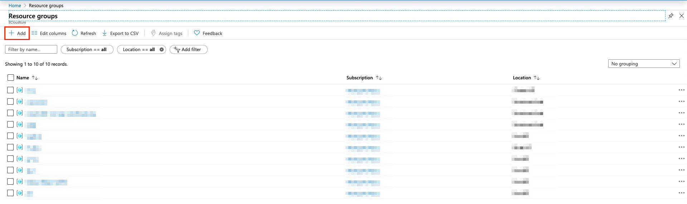

1.3. At `Basic` section, choose your `Subscription`, `Resource group` and the `region` where you want your resource group locate

1.4. Choose `Review + create`

1.5. When validation passed, click on `Create` 

1.6. Click the bell on the upper right hand corner, choose `Go to resource group`

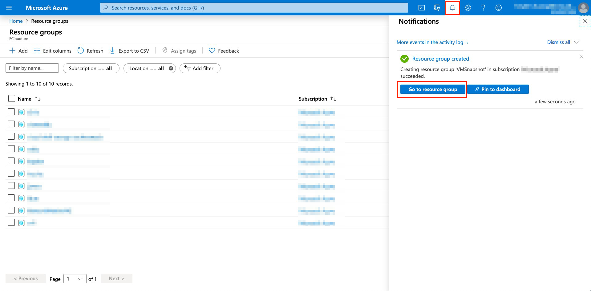

### Create a Virtual Machine
---
2.1. Click `+Add` to create a virtual machine in a resource group

2.2. Select `Compute`，then `Virtual Machine`

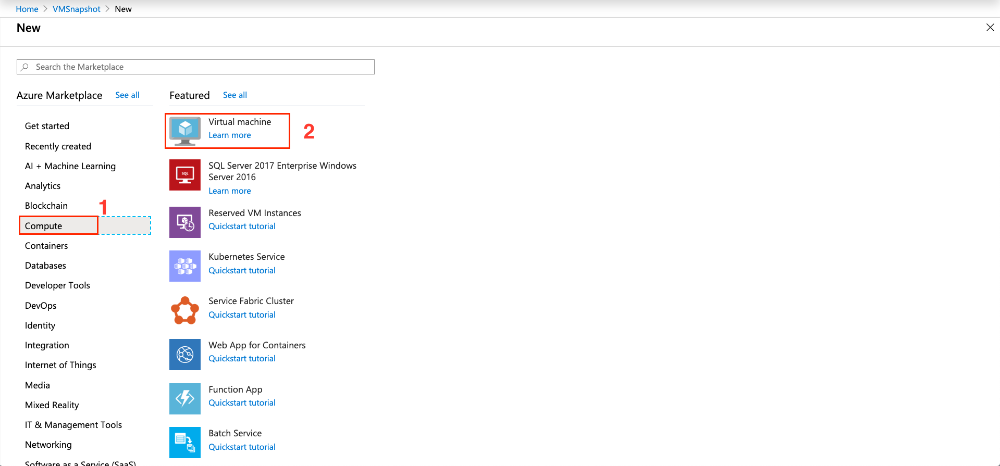

2.3. Fill in all the information that needed, choose `Review + create`

2.4. When validation passed, click on `Create` 

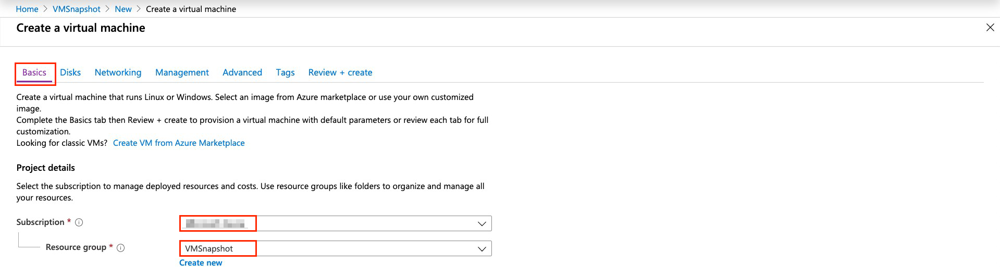

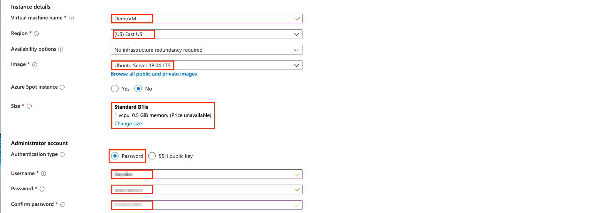

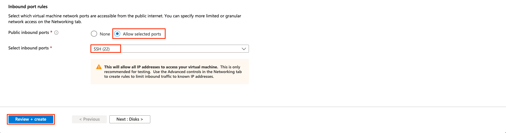

### Create SnapShot
---
3.1. After the virtual machine is created, choose `Go to resource`

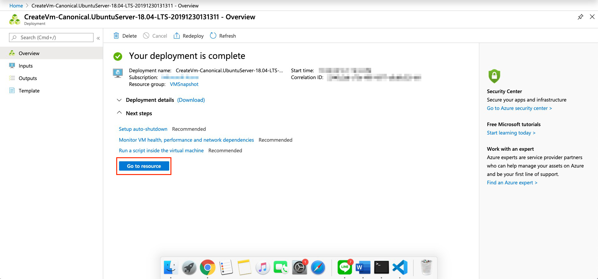

3.2. Under Settings section, choose `Disks`, then choose the OS Disk

3.3. Click on `Create snapshot` to make a snapshot of the disk

3.4. Fill in all the information that needed, place the snapshot at our resource group --> `VMSnapshot`，

3.5 Name you snapshot in  `Name` 和 choose the type that you need in `Account type`

3.6. Last, choose `Create`

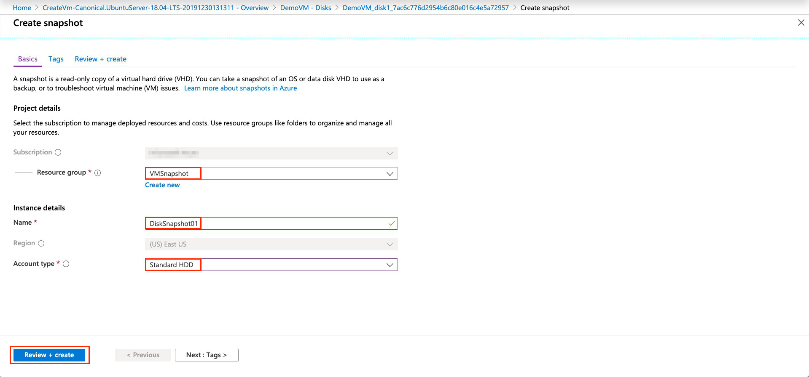

### Create Disk
---
4.1. Click `Microsoft Azure` on the top left hand corner to back to main page, choose `Create a resource`

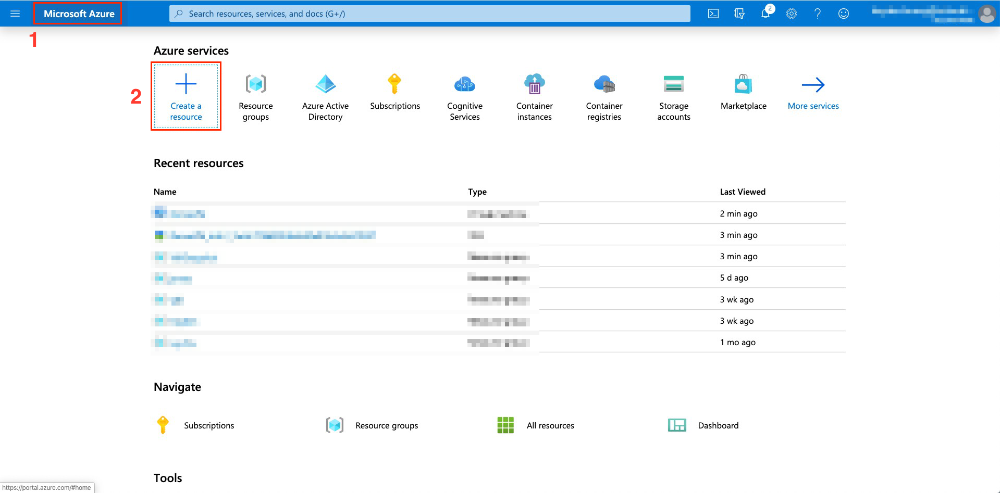

4.2. Type `Managed Disks` at the search bar, then hit Enter

4.3. Choose `Create` to create Managed Disks

4.4. Fill in all the information that needed, choose `Review + create`

4.5. When validation passed, click on `Create` 

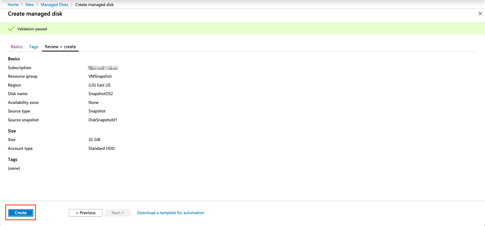

### Swap OS Disk
---
5.1. Click `Microsoft Azure` on the top left hand corner to back to main page, choose `Resource Group`

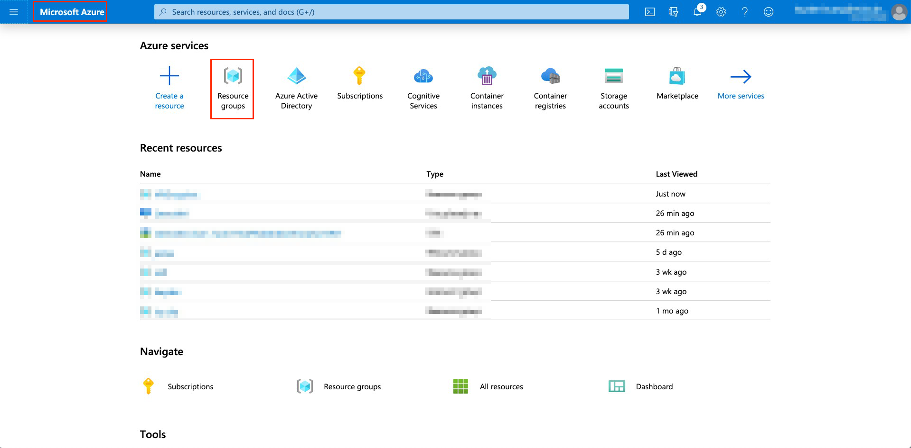

5.2. Choose your resource group --> `VMSnapshot`

5.3. Choose virtual machine that we create before --> `DemoVM`

5.4. Under Settings section, choose `Disks`, then choose `Swap OS Disk`

5.5. At the “Swap OS Disk” wizard, select the managed disk that we created --> `SnapshotOS2` 

5.6. Enter the name of virtual machine to make change, then press `OK`

5.7. In the background, the Azure Platform will stop, deallocate the VM and it will re-crate it with the selected OS disk. 

5.8. Refresh the page, as you see at the next screenshot the OS disk is the managed disk that we created from teh snapshot

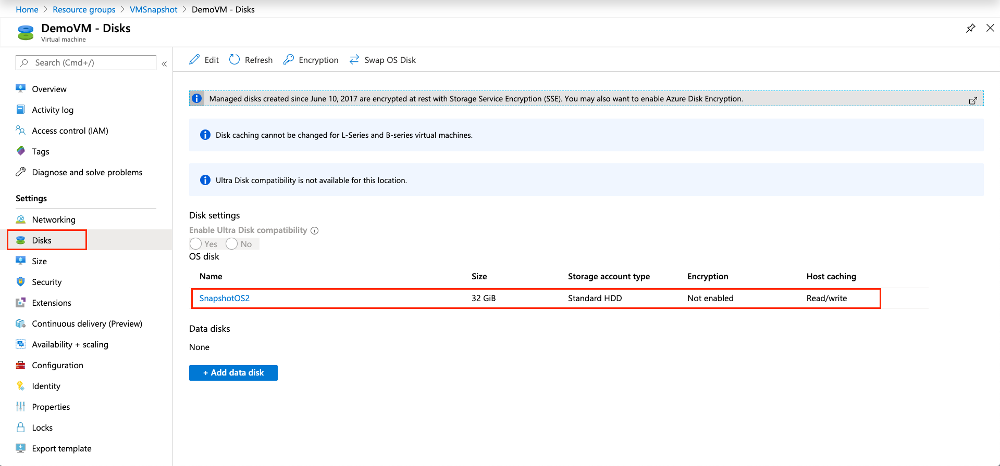

### Another option - New Azure VM
---
6.1. Open the Managed Disk that you created from the Snapshot and press `Create VM`

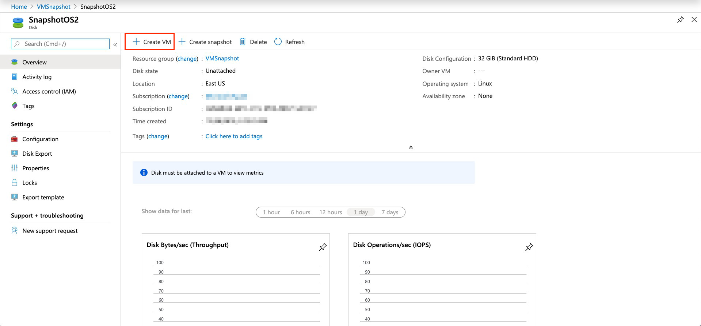

6.2. At the `Create a virtual machine` wizard, `image` will have selected the image form the disk

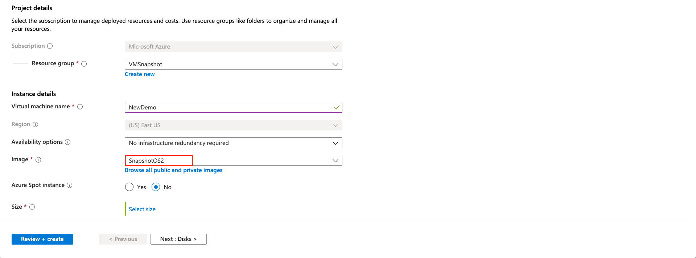

### Clean Up
---
7.1. Access to the resource group that you want to delete, choose `Delete resource group`，then click on the  `Delete` button to delete the resourece group and all resource in the resource group