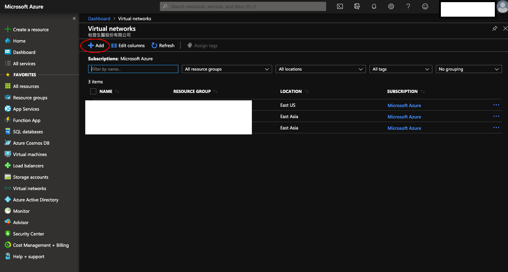
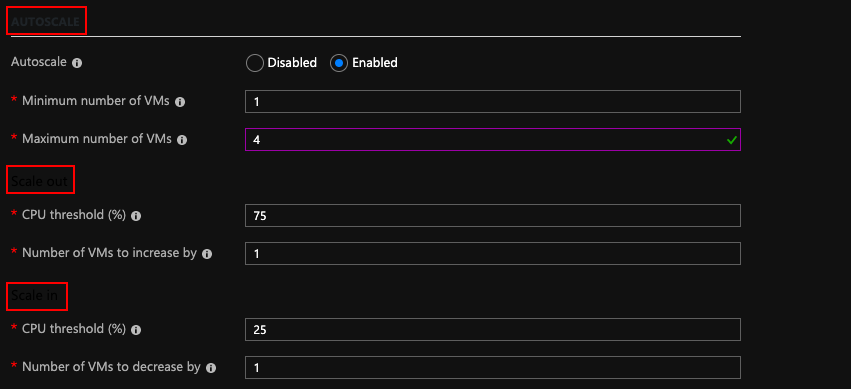
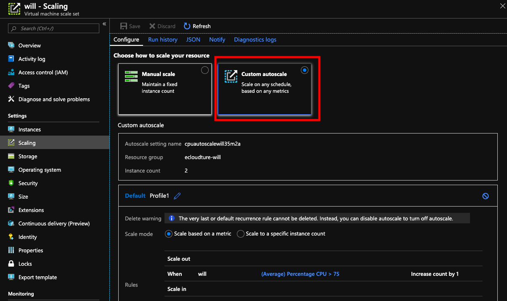
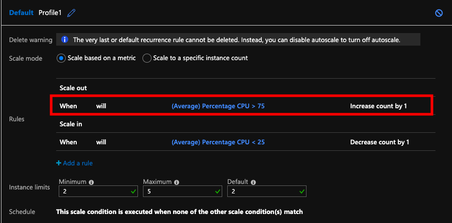
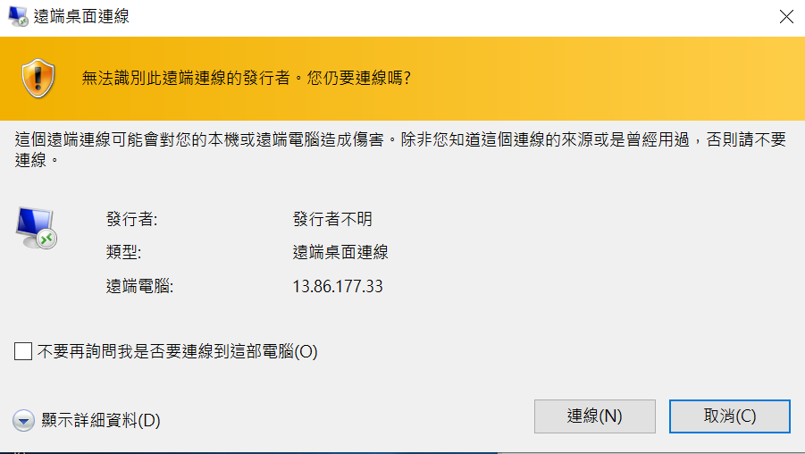
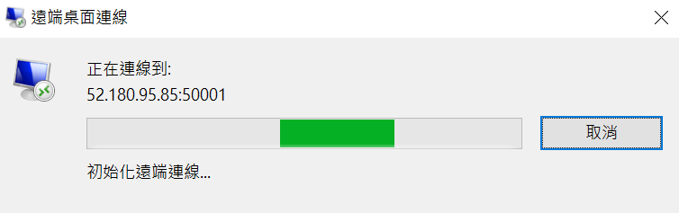
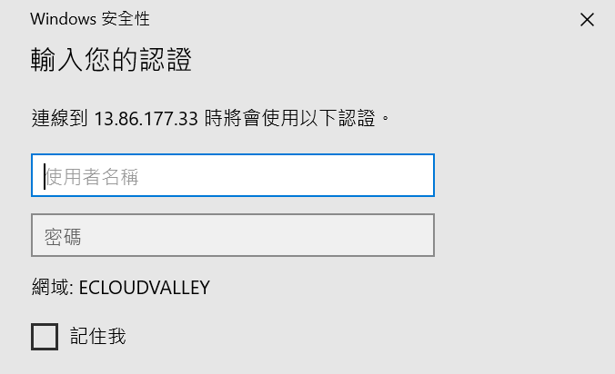
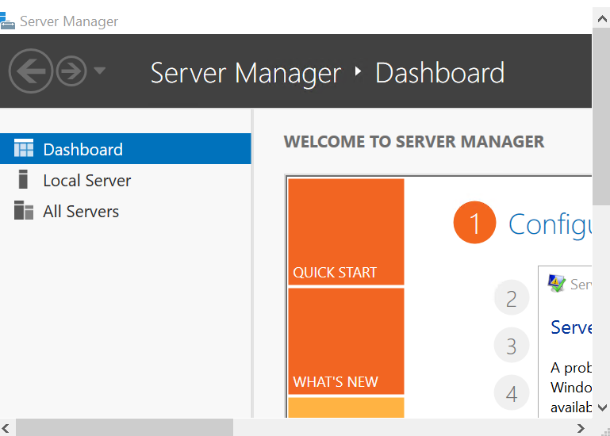

# Elastic your Architecture

## Overview
[Azure virtual machine scale sets](https://docs.microsoft.com/en-us/azure/virtual-machine-scale-sets/overview) can create and manage a group of identical, load balanced VMs,The number of VM instances can **automatically increase or decrease** in response to demand or a defined schedule.With virtual machine scale sets, Can build **large-scale** services for areas such as compute, big data, and container workloads.

[Azure Load Balancer](https://docs.microsoft.com/en-us/azure/load-balancer/load-balancer-overview) supports **inbound** and **outbound** scenarios, provides **low latency** and **high throughput**, and scales up to millions of flows for all **TCP and UDP** applications.

When there's huge or unstable traffic, you can use load balancer to distributes incoming traffic, and setup Auto scaling to generate enough instances to handle the traffic.

    

## Scenario
The following procedures help you set up a scaled and load-balanced application, you will start with **Azure Azure virtual machine scale sets** in Portal which automatically deploy **Load Balancer** and **Virtual Machine** Then you will have to finish  **Virtual Network** by your own

## Step by step 
### Deploy your Vnet environment.
A virtual network is the fundamental building block for your private network in Azure. It enables Azure resources, like virtual machines (VMs), to securely communicate with each other and with the internet

1. On the  Azure Portal , Select **Virtual networks**

    

2. Select **Add**

    

3. Input the followings then select Create and Close:

    * Name :  `ecloudture- your Name -net`
    * Address space :  `10.1.0.0/16`
    * Subscription : Select `your Subscriptions`.
    * Resource Group : Select `your Resource Group` 
    * Location :  `East US`
    * Subnet Name : `ecloudture- your Name -Subnet`
    * Subnet Address range :  `10.1.0.0/24`
    * DDOS protection : `Basic`
    * Server Endpoints : `Disable`
    * FireWall : `Disable`

    

4. Leave the rest as default and select **Create**

### Create Virtual Machine Scale Set
You can deploy a scale set with a Windows Server image or Linux image such as RHEL, CentOS, Ubuntu, or SLES.

1. Search for **Scale set**, choose **Virtual machine scale set**

    

2. Select `Create`

    

3. Input the followings
    

     * Virtual Machine Scale Set :  `Your Name`
     * Operating system disk image :  `Window Server 2016 Datacenter`
     * Subscription : `Your Subscription`
     * Resource group : `Your Resource group`
     * Location : `East US`
     * Username : `Your Name`
     * Password : `Your password`
     * Confirm Password:**Enter** `Your password`again

    

4. Setting Instance Count and Size

    * Instance Count:Enter : `2`
    * Instance Size : **Change Size** `Standard B1S`
    * Disploy as low Priority : `No`
    * Use managed disk : `Yes`

    

 5. Setting AutoScale rule
    
     Autoscale : `Enabled` 
    * Minmum number : `1`
    * Maximum number : `4`
    
    Scale out
    * CPU threshold(%) : `75`
    * Number of VMS to increase by : `1`

    Scale in 
    
    * CPU threshold(%) : `25`
    * Number of VMS to decrease by : `1`
    

    

  6. Setting Networking

     * Choose Load Balancing options : **Select**` Load balancer`
    
     * Public IP adress name : `Your name address`
     * Domain name label : `Your name domainname`

     Configure Virtual network

     * Virtual network : Select `Your virtual network`
     * Subsent : `Your Subsent `
     * Pubilc IP address per instance : `Off`
     * Public inbound Ports:`Allow selected ports`
        
        * Select inbound Ports:`RDP`,`HTTP`

    

   7. Setting Management
      
      * Boot diagnostics : `Off`
      * System assigned managed identity : `Off`

8. Select : **Create**

### Configured auto scaling Instance limits and **Scale Rule**
   
1. From the list of vitural machine Scale set, select **Scaling**

    

    
2. On Configure,Choose how to scale your resource : Select`Custom autoscale`

    

3. On Default Profile1,Scale Mode : Select`Scale based on a metric`

    

4. Choose **Scale Out** ,you can see **Scale rule** window

    

5. Check **Scale Rule**
        
    * Time aggregation :  `Average`
    * Metric namespace : `Virtual Machine Host`
    * Matric name : `Percentage CPU`
    * Time grain statistic : `Average`
    * Operator : `Greater then`
    * Threshold : `75`
    * Duration : `5`

    

 

    
   
 On Action
        
* Operation : `Increase count  by`
* Instance Count : `1`
* Cool down(minutes) : `1`
    
Select  **update**  
    
6. Choose **Scale in** ,you can see **Scale rule** window

    
   

7. Check **Scale Rule**
    
    * Time aggregation :  `Average`
    * Metric namespace : `Virtual Machine Host`
    * Matric name : `Percentage CPU`
    * Time grain statistic : `Average`
    * Operator : `Less then`
    * Threshold : `25`
    * Duration : `5`

    

    
   
   
On Action    
    
* Operation : `Decrease count by`
* Instance Count : `1`
* Cool down(minutes) : `1`
     
Select  **update**  

    
   
### Connect to a VM in the scale set
When you create a scale set in the portal, a load balancer is created. Network Address Translation (NAT) rules are used to distribute traffic to the scale set instances for remote connectivity such as RDP or SSH.

* For a Windows scale set, connect to the VM instance with RDP on`Your address:your TCP Port`
* For a Linux scale set, connect to the VM instance with SSH on `ssh azureuser@Your address  -p your TCP Port`

3. Search for **Scale set**, choose **Virtual machine scale set**

    

4. Select `Your Virtual machine Scale set`

    

5. From the list of **Virtual machine Scale set**,Select **Instance**

6. Choose **on of the VM** 

    

7. Click the **Connect** button 

    

8.  Click **Download RDP file**

    

9. Open the downloaded **RDP file** and **click Connect** when prompted

    

    

10. In the Windows Security window, select More choices and then Use a **different account**

    

    

11. Type the username as **localhost\username**

12. Enter password you created for the virtual machine scale set, and then click OK.

    

### Clean up resources
In the resource group,**Delete resource**

* Virtual network

* Virtual machine Scale Set

* Load Balancer

* Network security group

* Public IP address

### Conclusion

Congratulations! You now have learned how to:

* Create Virtual network

* Create Virtual machine Scale Set

* Seeting AutoScale rule

* Create Load Balancer

* Ibound NAT rule

* Connect VM in VM Scale set

