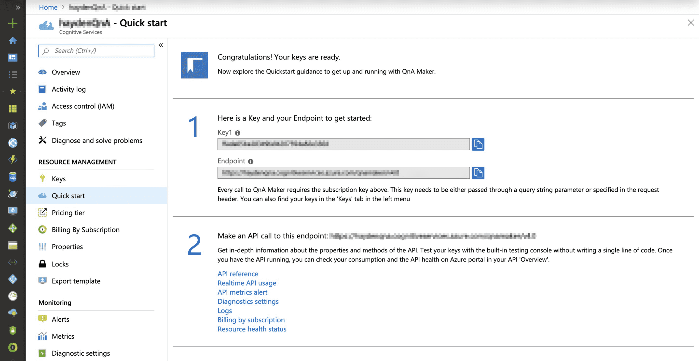
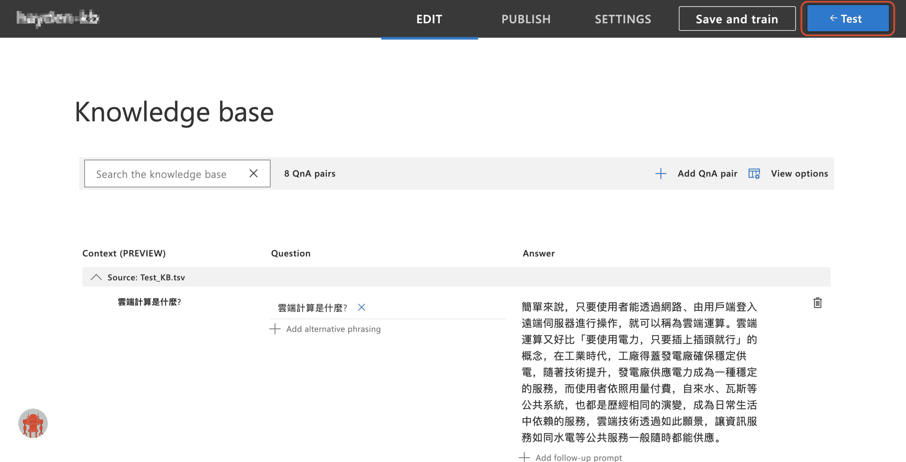

# Create Chatbot with Azure Bot Server + QnA Maker

## Introduction
Azure Bot Service and Bot Framework provide tools to build, test, deploy, and manage intelligent bots all in one place. Through the use of modular and extensible framework provided by the SDK, tools, templates, and AI services developers can create bots that use speech, understand natural language, handle questions and answers, and more.

## Scenario
First we must first set up a QnA Maker service in Azure. Then create a new knowledge base with questions and answers from a public web-based FAQ. Save, train, and publish the knowledge base. Lastly, create a QnA chat bot from the Publish page for an existing knowledge base.

## Lab tutorial
### Create a QnA service in Microsoft Azure
1.1. Login to your Azure Portal account

1.2. Choose **Create a resource** at the left of the portal

1.3. Search for **Qna Maker**

1.4. Choose **Create**

1.5. Fill in all the information that is required.

1.6. Choose **Create**

1.7. There will show that the deployment is progress in the upper right corner of the portal.

1.8. Until the deployment secceeded, choose **Go to resource**. It will show the QnA Maker console.

### Create Knowledge Base for QnA Maker
2.1. Use your Azure account, sign in to the [QnA Maker](https://www.qnamaker.ai/)

2.2. Choose **Create a knowledge base**.

2.3. Since we already create the QnA service, so skip the first step.

2.4. Step 2, choose your existing settings

2.5. Step 3, Name your Knowledge Base

2.6. Step 4, choose **Add fiel**, select **Test_KB** to upload.

2.7. Choose **None**.

2.8. Step 5, choose **Create your KB**.

2.9 Wait until the enviroment setting up.

2.10. When the process done, you can choose **Test** to test your bot.

> You also can create a new QnA through choosing **Add QnA pair**.

> Remember to choose **Save and Train** if you have made any changes.

2.11. Choose **Publish**. Then choose **Publish** to publish your knowledge base.

2.12. Wai until the publishing done.

2.13. Deploy success. **Don't close** this  page if you need it for future use.

2.14. Choose **Create Bot**, the Azure Portal will opens in new tab.

### Create Web App Bot
3.1. Fill all the requirement.

    | Setting | Value |
    | -------- | -------- |
    | Bot handle |  Name yourself | 
    | Subscription |  Same subscription as you used to create QnA Maker |
    | Resource group |  Choose yourself | 
    | Location |  East Asia | 
    | Pricing tier |  F0 | 
    | App name |  Same with Bot handle | 
    | SDK |  C# | 
    | QnA Auth Key |  **Don't change** | 
    | App service plan/Location |  **Don't change** |
    | Azure Storage |  **Don't change** |
    | Application Insights |  **Don't change** |
    | Microsoft App ID |  **Don't change** |
3.2. Choose **Create**.

3.3. Wait until the process done.

3.4. Deployment succeeded. Choose **Go to resource**.

### Testing
4.1. Choose **Test in Web Chat**, try to get in touch with your Bot and see what it will reply.

### Clean Up
5.1. Check **Name**

5.2. Choose **Delete**.

5.3. Type **yes** to confirm delete the resource you checked.

5.4. Choose **Delete**.

### Reference
- [QnA Maker](https://docs.microsoft.com/en-us/azure/cognitive-services/qnamaker/)