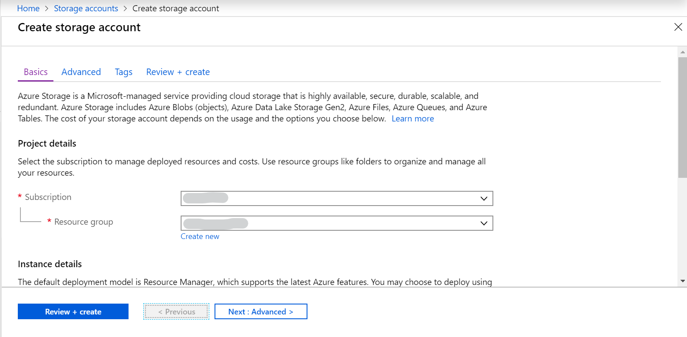
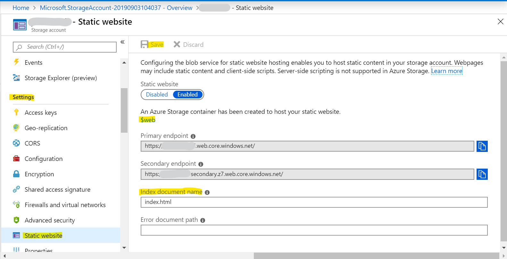
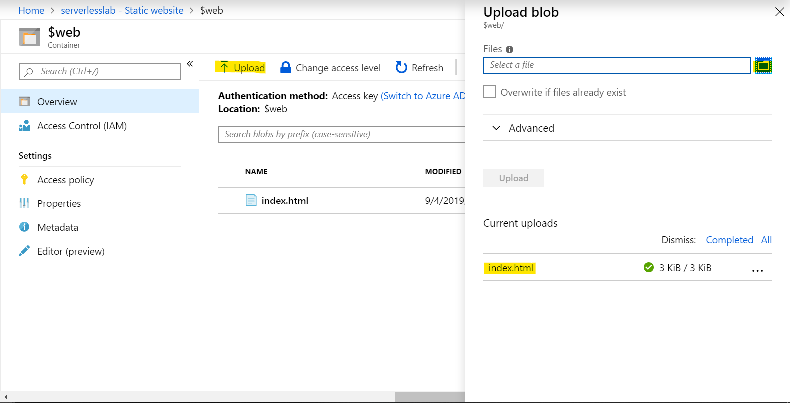
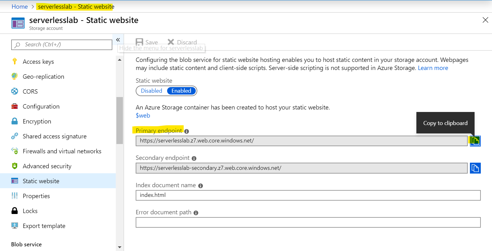
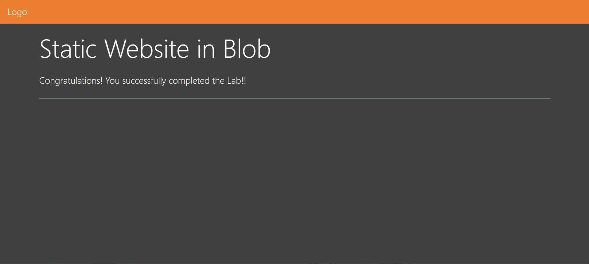

# Build Static Website with Azure blob storage

## Scenario
You will host a static website in blob without any Virtual Machine or Container, which enable you to rapidly build your own website.

## Prerequisites
>The workshop’s region will be in ‘East US’

>Download index.html which is in <code>1.Static_Website_with_Blob_Storage</code> directory.

## Lab tutorial
### Create Storage account
1.1.  Search for **Storage accounts**, click **Add**.

1.2. Select **Resource Group** to organize your resource, if you don't have one, you can create a new resource group.

1.3. For Storage account name, type a **Unique Name**.

1.4. For Region, choose **(US) East US**.

1.5. Click **Review+create** button on lower left side, then click **Create**.

### Create Static website hosting through Storage account settings

2.1. Find **Settings** tab, and click  **Static website**.

2.2. Click **Enable** in the main pannel.

2.3. Type **index.html** for the index document name, and click **Save**.

### Upload files to blob

7.1. Search for **Storage accounts**, choose **Settings** tab and click  **Static website**

7.2. Click **$web** which locates in the middle of pannel.

7.3. Click **Upload**.

7.4. Select and add the **index.html** which you previously edit.

7.3. Click Upload button on lower side without any setting.

### View blob static website hosting

8.1. Back to the **Settings** tab, and click  **Static website**.

8.2. Copy the **Primary Endpoint** and paste to a new tab of your browser.

8.3. You will see the website as below:

## Conclusion

Congratulations! You now have learned how to:
* Create a static website hosting through blob