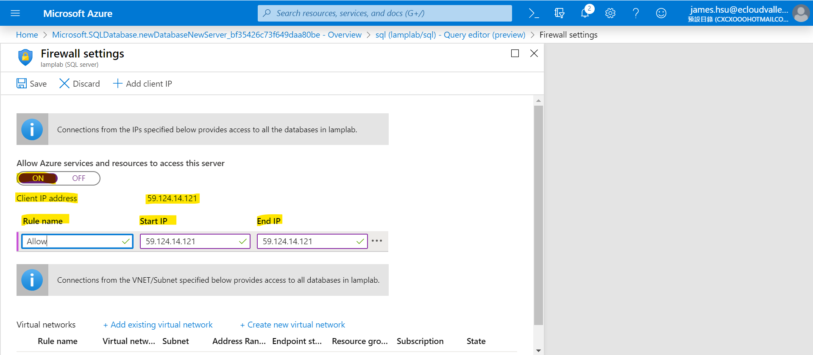

# Build LAMP Structure in Azure Virtual Machine

## Scenario
You will host a LAMP Structure, which indicates Linux, Apache, MySQL and PHP, in Azure Virtual Machine.
You will also use Azure SQL Database to save your data.
## Prerequisites
>The workshop’s region will be in ‘East US’

>Download index.html which is in <code>2.Build_LAMP_Structure_in_Azure_VM</code> directory.

### Create Virtual Machine

1.1. Search for **Virtual Machine**, choose **Settings** tab and click  **Static website**


1.2. Click **Add** in the main pannel.


1.3. For **Resource Group**, choose your own Resource Group.

1.4. For **Virtual machines name**, type name you prefer.

1.5. For **Region**, choose **(US) East US**.

1.6. For **Image**, choose **Ubuntu Server 18.04 LTS**.


1.7. For **Authentication type**, choose **password**.

1.8. For **Username & Password**, type name you prefer.

1.9. For **Select inbound ports**, choose **HTTP (80), HTTPS (443), SSH (22)**.


1.10. Go to **Advanced** Tab.


1.11. For **Cloud init**, type following code.
```
#cloud-config
runcmd:
- 'sudo wget https://raw.githubusercontent.com/JamesHsu333/ScaleSet/master/2.Build_LAMP_Structure_in_Azure_VM/runscript.sh'
- 'sudo chmod +x runscript.sh'
```

1.12 Click **Review + create** & **Create**.


1.13 Click **Go to Resource**.


### Connect to Virtual Machine

2.1. Open your **CMD/Terminal**, for **Windows** click <code>Windows + R</code> and type <code>cmd</code>


2.2. Back to Azure Portal, and copy **Public IP address**


2.3. Switch to CMD/Terminal and type <code>ssh username@PublicIpAddress</code> which you create at former step.


2.4. Type <code>sudo su</code>and<code>/runscript.sh</code> to run shell script and wait a minute.


2.5. Copy **Public IP address** to browser and check the website.


### Create SQL database

3.1. Type **SQL** at search bar, and choose **SQL databases**.


3.2. Click **Add** in the main pannel.


3.3 For **Resource Group**, choose your own Resource Group.

3.4. For **Database name**, type name you prefer.

3.5. For **Server**, click **Create new**.

3.6. For **Server name, Server admin login & Password**, type value you prefer.

3.7. Click **OK** to Create New Server.


3.8. Go to **Additional settings** Tab.

3.9. For **Using existing data**, choose **Sample**.

3.10. Click **Review + create** & **Create**


3.11 Click **Go to Resource**.


### Set SQL database

4.1. Click **Query editor** from left blade.


4.2. Sign in with your account (Setting at Step 3.6.) and click **Set server firewall**.


4.3. Switch **On** button and Copy **Client IP address** and paste to **Start IP** & **End IP**.

4.4 Click **Save**.



4.5. Back to **Query editor** and Login again.

### Connect to SQL database

5.1. Back to the website (Step 2.5.)


5.2. For **Server Name, Database name, User Name & Password**, type the information you construct at **Step 3.6.**

5.3. Complete the Lab.

## Conclusion

Congratulations! You now have learned how to:
* Create a Virtual Machine
* Create a SQL database
* Connect to Virtual Machine
* Connect to SQL database