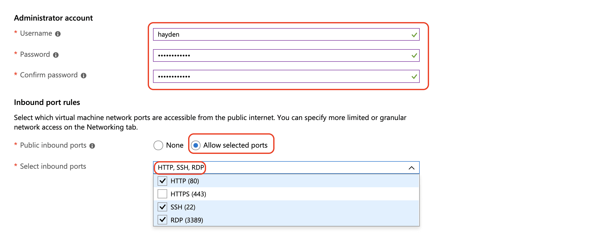
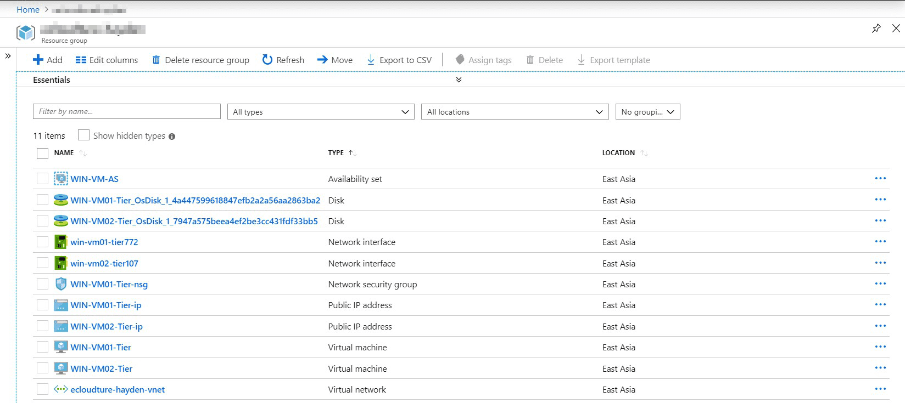
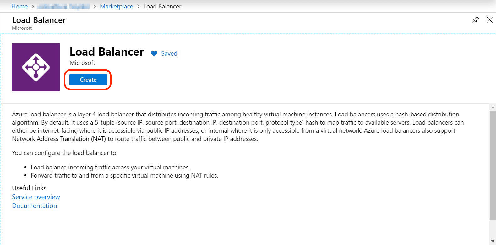
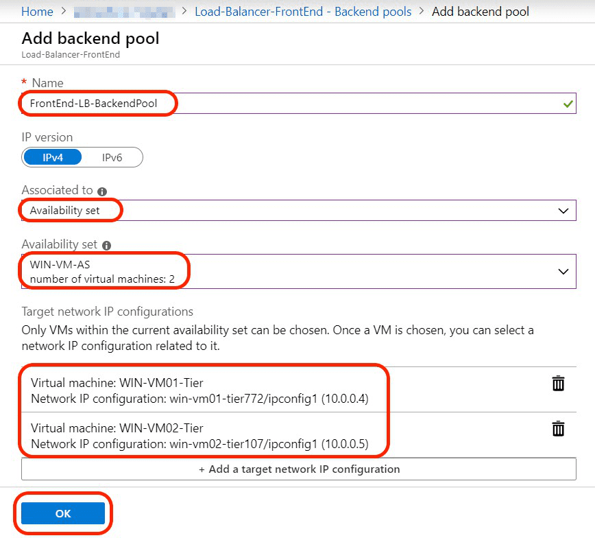
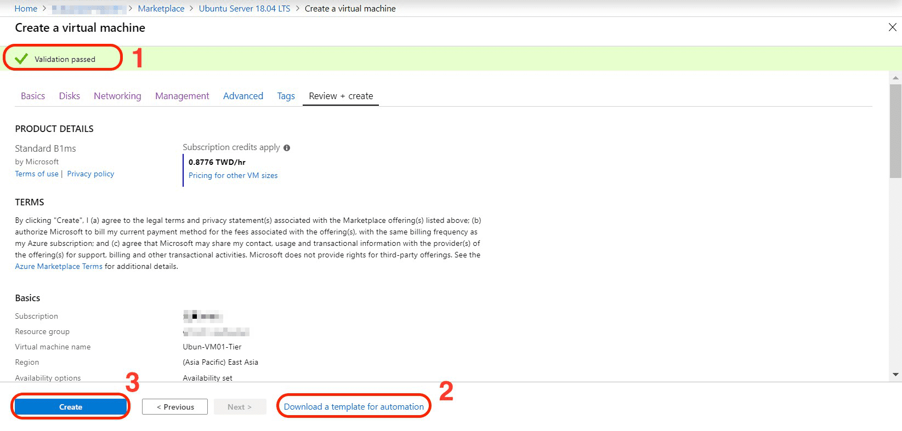
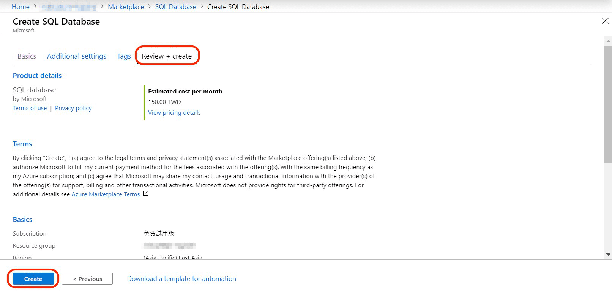

# Implement for 3-tier architecture

## What We're Going to Do

A three-tier architecture is a client-server architecture in which the functional process logic, data access, computer data storage and user interface are developed and maintained as independent modules on separate platforms. Three-tier architecture is a software design pattern and a well-established software architecture.
### What does it do?
- This application structure makes it easier to handle spikes of traffic to scale
- It gives you Microsoft's 99.95% SLA for virtual machines
- Considered a high-availability architecture, although there are still some single point of failure with the region and the load balancer.

### See What We Will Create Together
- Public load balancer
- 2 Windows virtual machines(created by Azure portal and PowerShell)
- Internal load balancer
- 2 Linux virtual machines(created by Azure portal and CLI)
- Azure SQL Database(with failover configuration to another region)
---
## Create Virtual Machines and Load Balancers
### Create Our First Windows VM using the Azure Portal
- Choose **Resource groups** at the left of the panel and choose your resource group.
- If you don't have any resource group, just choose **Add** to create one.

- Choose **Add** to  create a new resource in your resource group.

- Type **windows server** at the search bar.
- Choose **Windows Server**.

- Choose **Windows Server 2016 Datacenter**
- Choose **Create**

- At the **Basic** section, any required must be choose or create.

- At **Disk** section, select **Standard HDD**

- At **Networking** section, virtual network & subnet & Public IP will created automatically. 

- At **Management** section, you can turn on anything you want. At here, we choose **Off** for everything.

- At **Advanced** section, choose **Next**.

- At **Tags** section, choose the **Name** and **Value** if you have, then **Next**.

- At **Review + create** section, make sure your Valid is passed.
- Please **download a template for automation** for future use.
- Last, choose **Create**

### Create Another Windows VM Using ARM Templates and PowerShell
- Open the files in the previous downloaded folder, we'll modify some value in **parameters.json**.

- We need to change the name or value of **networkInterfaceName** + **publicIPAddressName** + **virtualMachineName** + **adminPassword** before deploy to Azure.

- Open **Windows Power Shell**

- Go to the template's folder directory, Type **dir** command to show what we have in the folder.
- <pre><code>Set -ExecutionPolicy -Scope Process -ExecutionPolicy Bypass</code></pre>
- Type Y for any questions.

- <pre><code>./deploy</code></pre>
- Fill your Subscription ID & ResourceGroupName.
- Login to your Azure account on the panel.

- After login to your Azure account, it'll show **Starting deployment**
- Wait until the deplotment success.

- After the deploy success, check out the resource you've create in your resource group. 

### Create Both of the Load Balancers
At this part, we'll create two load banlancer(one for Public and another for Internal use). So firstly, let us create the Public Load Balancer.
- Choose **+Add** to create a resource inside your resource group.

- Type **load balancer** at the search bar.
- Choose **Load Balancer**.

- Choose **Create** to create load balancer 

- Fill in all the requirement, make sure you have choose the type of load balancer as **Public**.
- Choose **Next:Tags**

- At **Tags** section, choose the **Name** and **Value** if you have, then **Next:Review + create**.

- Wait the page showing **Validation passed** before creating this load balancer.

To create a Internal Load Balancer, just following the same step with how you create Public Load Balancer. The only things you need to change is the type of load balancer need to be "Internal".

- After create all the load balancer, we need to configure the **Backend pools** to each load balancer
- Choose your public load balancer in your resource group.

- Choose **Backend pool**, then choose **+Add**

- Fill in all the requirement, we'll need to configure this load balancer associated to Availability  Set beacause two of the windows virtaul machines are in one availability set.
- Choose **OK** if done.

- When it's done, we can see the result on the panel.

### Create Our First Linux VM using the Azure Portal
- At your resource group, add a resource through a marketplace
- Type **ubuntu** at the search bar and choose **Ubuntu Server 18.04 LTS**

- Choose **Create**

- At **Basic** section, fill in all the requirements.
- Same with create windows virtual machines, also create an availability set for Ubuntu virtual machines.
- Size of ubunutu vm : **Standard B1ms**

- We'll would like to use ssh connect to ubuntu vm, it's required a public key to access, so let's create our own key.
- Copy your public key for later use.

- Back to **Basic** section, choose **SSH public key**, type in the name you used to login to your vm and paste the public key that we create just now.
- Allowed SSH inbound ports.
- Choose **Next:Disks**.

- At **Disk** section, **Standard HDD** for OS disk type.

- At **Networking** section, fill in the requirement.
- Make sure that ubuntu vm don't need a public ip, because we don't want anyone can access to this tier through public ip.

- At **Management** section, you can turn on anything you want. At here, we choose **Off** for everything.

- At **Tags** section, choose the **Name** and **Value** if you have, then **Next:Review + create**.

- At **Review + create** section, make sure your Valid is passed.
- **Download a template for automation** before you create the first machine.

### Create Another Linux VM Using Bash Scripts / Cloud Shell
- Open the files in the previous downloaded folder, we'll modify some value in **parameters.json**.
- We need to change the name or value of **networkInterfaceName** + **virtualMachineName** + **adminPublickey** before deploy to Azure.

- Choose Cloud shell on the top of the portal. It will show out a terminal at the bottom.
- Choose **Create storage**

- Wait until the initiallize complete, enter "ls -a" in your terminal to check out what you have in this directory.

- We would like to use terminal to deploy our second ubuntu virtual machine. Because we don't have any files that we need to use, so let upload some files.

- there's some command that we need to use:
<pre><code>chmod +x deploy.sh</code></pre>
<pre><code>sed -i -e 's/\r$//' deploy.sh</code></pre>
<pre><code>sed -i -e 's/\r$//' template.json</code></pre>
<pre><code>sed -i -e 's/\r$//' parameters.json</code></pre>
<pre><code>./deploy.sh</code></pre>

- We'll asked to enter **Subscription ID** + **Resource group name** + **name of deployment** + **resource group location** before running the deployment process.
- It'll show **Template has been successfully deployment** when the deploy seccess.

- Last step of this part, remember config the backend pool of the Internal
- At your resource group, choose your Internal Load Balancer and seclect **Backend pools** and **Add**
- Fill in all the requirement, we'll need to configure this load balancer associated to Availability Set beacause two of the windows virtaul machines are in one availability set.
- Choose **OK** and see the result.

---
## Create Databases

### Create Our SQL Database
- Choose **+Add** to add a resource into you resource group.

- Type **sql database** at the search bar and choose **SQL Database**.

- Choose **Create**

- Fill in the require blank, creat a new server for this database.

- Choose **Basic** and **Apply**

- At **Tags** section, choose the **Name** and **Value** if you have, then **Next**.

- Choose **Create**

### Set Up Automatic Failover to a SecondaryRegion
- After the deployment is complete, choose **Go to resource**

- Choose **Geo-Replication**, then select **SouthastAsia** as our secondary database.

- Create target server for the secondary database and choose **Basic** for the Pricing Tier

- Wait until the Status become **Readble**

- Scroll the page to the top, choose the pop-up bar to create a failover group.

- Finished all the requirement then choose **Create**.

---
## Clean Up and Testing
### Install IIS Web Server on the Windows Virtual Machines
In this part, we'll install IIS web server on the windows vm, this step should be done to the second front end server and install a web server there as well.
- Choose the one of your Windows VM 

- Choose **Connect** and **Download RDP file**, Click on the file that you've download.

- Choose **Connect** and fill in your information to login to the windows vm

- Choose **Yes**.

- After login to the computer, Server Manager will show up automatically.
- Choose **Add roles and features**

- For server roles, choose **Web Server(IIS)**
- **Add features** for the pop out windows.
- Choose **Next**

- For features, select **ASP.NET4.6**
- Choose **Next**.

- For confirmation, choose **Install**.

:::warning 
⚠️Remember to install web server for the second windows vm.
:::

### Configure Front-End Load Balancer for Public Traffic
- Choose public IP address of the public load balancer

- Choose **Configuration**
- Type in **DNS name label**
- Choose **Save**

- Choose the Public Load Banlancer in your resource group.

- Choose **Health prob** and **+Add**

- Fill in the requirement and choose **OK**

- Choose the windows vm's network security group in your resource group.

- Choose **Inbound security rules**. We've already add 80, 22, 3389 port.
- We need to add a new rules for port 443. Choose **+Add**
- Fill in all the information that needed.

- Back to your Public Load Balancer, choose **Load balancing rules** and **Add**.

- Fill in the requirement and choose **OK**

### Configure Back-End Load Balancer for Internal Traffic
- Choose the Public Load Banlancer in your resource group.

- Choose **Health prob** and **+Add**

- Fill in the requirement and choose **OK**

- Choose **Load balancing rules** and **Add**.

- Fill in the requirement and choose **OK**

### Testing
- Choose public IP address of the public load balancer

- Copy the DNS name, and paste it to chrome, it'll show as below

### Clean
- At your resource group, select **Name** to choose all the resource that you create.
- Choose **Delete** at the upper right corner.
- For confirm delete, type **yes** to confirm delete
- Lastly, choose **Delete**.

